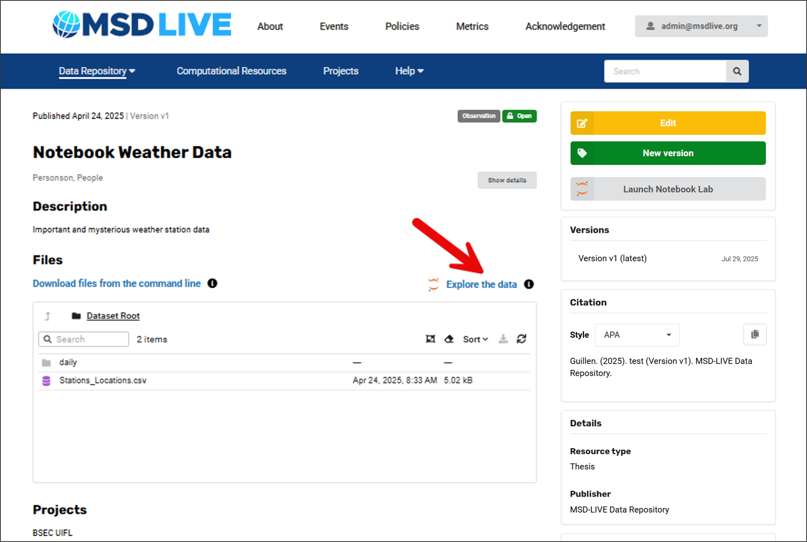
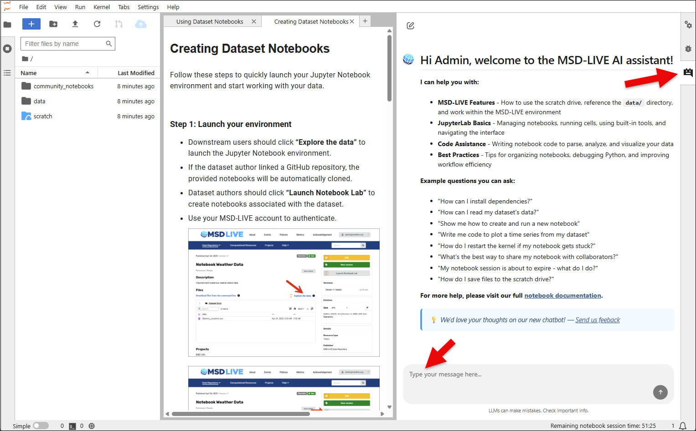
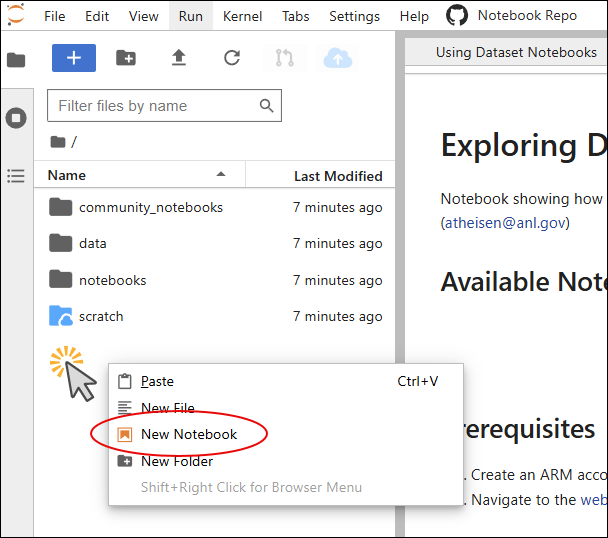
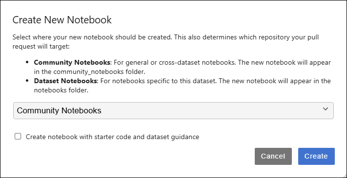
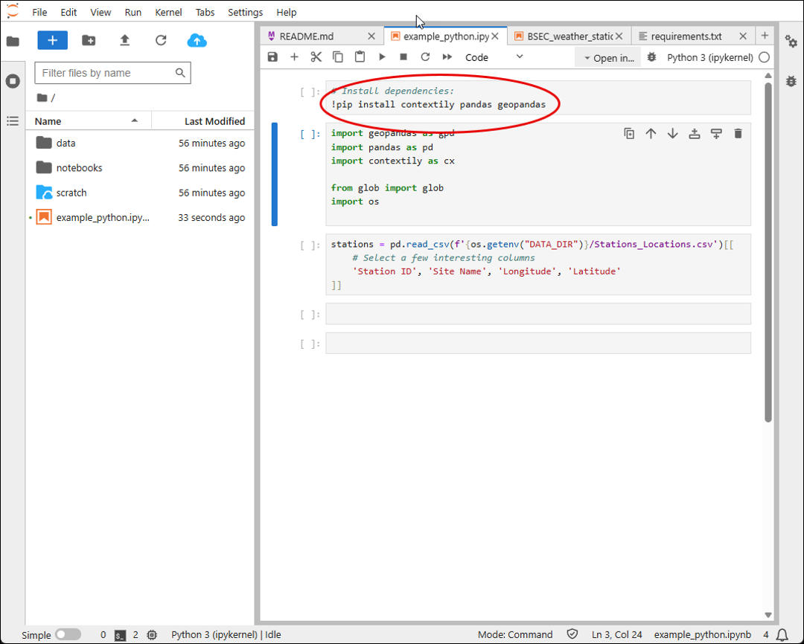
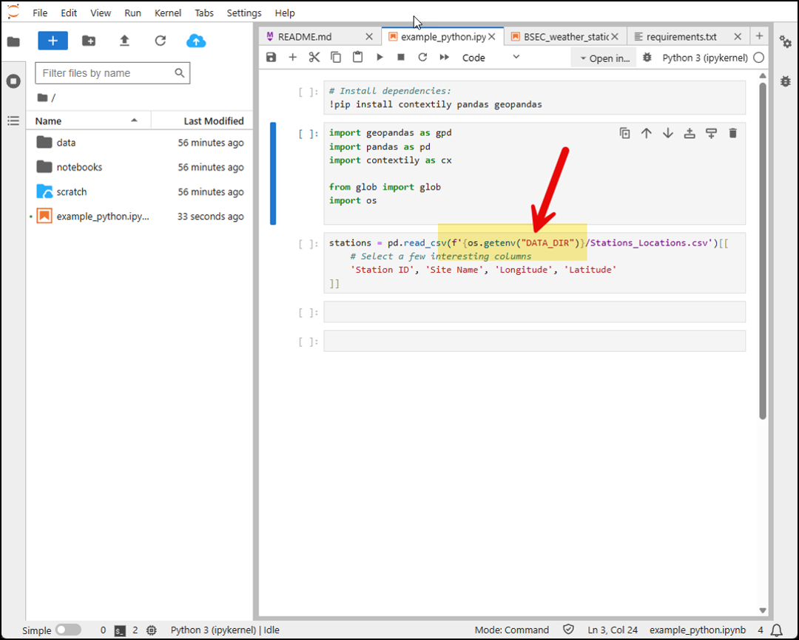

# Creating Dataset Notebooks
Follow these steps to quickly launch your Jupyter Notebook environment and start working with your data.

## Step 1: Launch your environment
- Downstream users should click “Explore the data” to launch the Jupyter Notebook environment.

- If the dataset author linked a GitHub repository, the provided notebooks will be automatically cloned.

- Dataset authors should click “Launch Notebook Lab” to create notebooks associated with the dataset.

- Use your MSD-LIVE account to authenticate.

## Step 2: Using the MSD-LIVE AI Assistant (optional)

You can also open the MSD-LIVE AI Assistant from the right sidebar at any time.
This built-in chatbot is designed to help you write high-quality dataset notebooks. It can assist with:

- MSD-LIVE features – how to use the scratch drive, reference the data/ directory, and work within the MSD-LIVE environment

- JupyterLab basics – managing notebooks, running cells, and navigating the interface

- Code assistance – writing Python code to parse, analyze, and visualize your dataset

- Best practices – organizing notebooks, debugging, and improving workflow efficiency

Use it whenever you need quick guidance or examples while developing your notebooks.

## Step 3: Create notebooks
After logging in to your notebook environment, right-click in the file explorer panel and select **“New Notebook”**.

- If the dataset has a linked repository:

    - Choose the notebook folder: Community Notebooks (for general or cross-dataset notebooks) or Dataset Notebooks (for notebooks specific to this dataset).

    - Optionally check “Create notebook with starter code and dataset guidance” to pre-fill your notebook with examples and environment tips.

- If the dataset does not have a linked repository:

    - Only the starter code option appears. Check it to pre-fill your notebook with examples and environment guidance.

## Step 4: Import required packages
In your new notebook, start by importing the necessary libraries from an empty cell. For example using python:

Click HERE for detailed examples on how to import libraries in Python, Julia, and R.

## Step 5: Access data
Use the **"DATA_DIR"** environment variable to access the location where a copy of your data is stored.

## Step 6: Complete your notebook(s)
Now you're ready to write custom code to visualize/analyze the data or to create workflows for subsetting the data in space and time.

## Step 7: Update README.md file
If your notebook will be saved to GitHub through a pull request (PR), update the README.md file to include your new notebook and a short description of what it does.

- If you are the dataset author creating the first notebook, be sure to replace all placeholders marked with {{ }} in the README.md.

- If you are adding additional notebooks, add an entry describing your new notebook so other users know what it provides.

## Step 8: Contributing changes
After you have completed edits to your notebooks and the README.md file, commit changes back to the repository via a GitHub pull request (PR):

- CTRL-click to select all the files you have changed.

- Click the pull request (PR) button to submit your changes.

Where the PR goes depends on the notebook folder:

- community_notebooks — PRs are sent to MSD-LIVE administrators for review and approval.

- notebooks — PRs are sent to the dataset owner.

Click HERE for more information on using MSD-LIVE's PR tool.