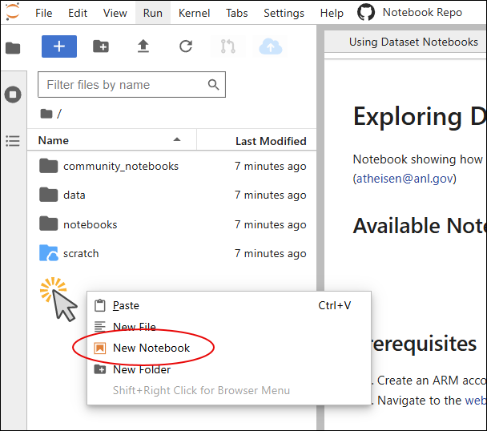
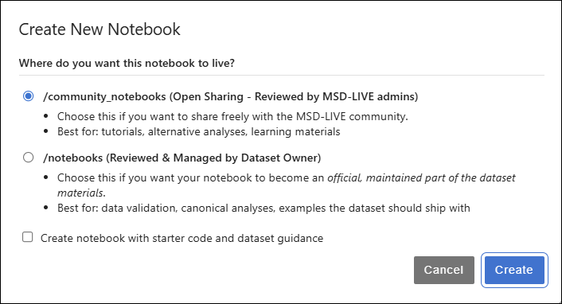
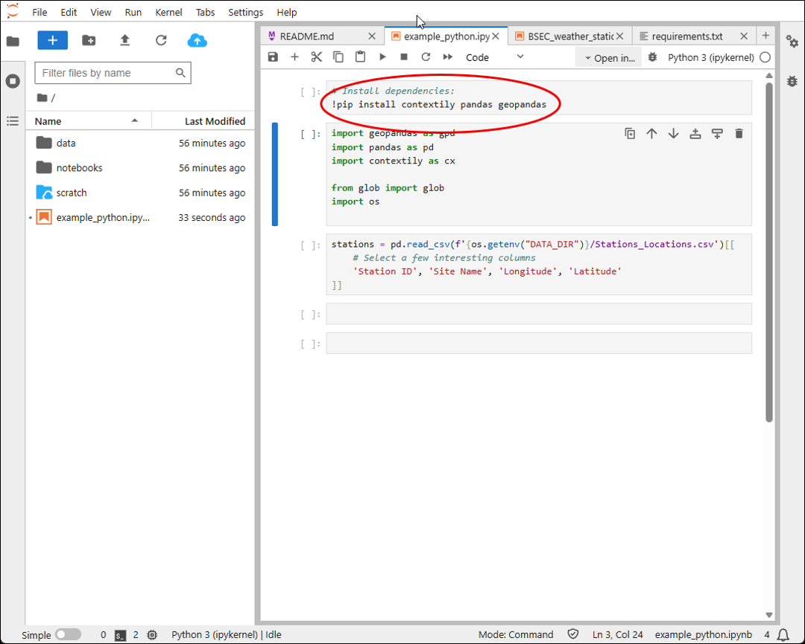

# Creating Notebooks

This guide covers how to create and work with Jupyter notebooks in MSD-LIVE's notebook environment. This applies to both dataset authors creating example notebooks and downstream users writing their own analysis code.

## Launching the Environment

**For downstream users:**
- Click **"Explore the data"** to launch the Jupyter Notebook environment
- If the dataset author linked a GitHub repository, the provided notebooks will be automatically cloned

**For dataset authors:**
- Click **"Launch Notebook Lab"** to create notebooks associated with the dataset
- Your dataset's GitHub repository will be automatically cloned if linked

Authenticate using your MSD-LIVE account to access the environment.

---

## MSD-LIVE's AI Assistant

You can open the MSD-LIVE AI Assistant from the right sidebar at any time.
This built-in chatbot is designed to help you write high-quality dataset notebooks. It can assist with:

- **MSD-LIVE features** – how to use the scratch drive, reference the data/ directory, and work within the MSD-LIVE environment

- **JupyterLab basics** – managing notebooks, running cells, and navigating the interface

- **Code assistance** – writing Python, R, or Julia code to parse, analyze, and visualize your dataset

- **Best practices** – organizing notebooks, debugging, and improving workflow efficiency

Use it whenever you need quick guidance or examples while developing your notebooks.

---

## Creating New Notebooks

After logging in to your notebook environment, right-click in the file explorer panel and select **"New Notebook"**.

### If the dataset has a linked repository:

- Choose the notebook folder:
    - **Community Notebooks** – for general or cross-dataset notebooks
    - **Dataset Notebooks** – for notebooks specific to this dataset

- Optionally check **"Create notebook with starter code and dataset guidance"** to pre-fill your notebook with examples and environment tips

### If the dataset does not have a linked repository:

- Only the starter code option appears
- Check it to pre-fill your notebook with examples and environment guidance

---

## Importing Packages

In your new notebook, start by importing the necessary libraries. For example, using Python:

For detailed examples on how to import and install libraries in Python, Julia, and R, see [Working with Data](working_with_data.md).

---

## Accessing Data

Use the **"DATA_DIR"** environment variable to access the location where a copy of your data is stored.

Now you're ready to write custom code to visualize/analyze the data or to create workflows for subsetting the data in space and time.

For more information on working with data, see [Working with Data](working_with_data.md).

---

## Update the README

If your notebook will be saved to GitHub through a pull request (PR), update the README.md file to include your new notebook and a short description of what it does.

- **If you are the dataset author creating the first notebook**, be sure to replace all placeholders marked with `{{ }}` in the README.md

- **If you are adding additional notebooks**, add an entry describing your new notebook so other users know what it provides

---

## Contributing Changes

After you have completed edits to your notebooks and the README.md file, commit changes back to the repository via a GitHub pull request (PR):

1. CTRL-click to select all the files you have changed
2. Click the pull request (PR) button to submit your changes

Where the PR goes depends on the notebook folder:

- **community_notebooks** — PRs are sent to MSD-LIVE administrators for review and approval
- **notebooks** — PRs are sent to the dataset owner

For more information on contributing notebooks, see:

- [Notebook Lab for Dataset Authors](notebook_lab.md)
- [Explore Data in Notebooks](using_notebooks.md#contributing-notebooks-back)
