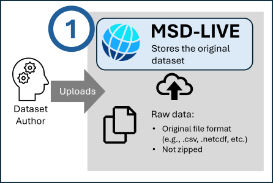
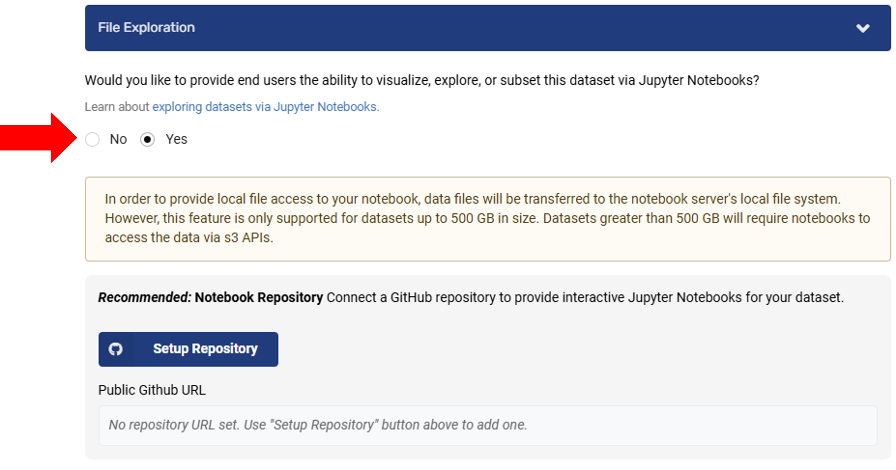

# Dataset Authors: Enabling File Exploration

The first component of MSD-LIVE's dataset notebooks feature is uploading raw data files and enabling this feature on a dataset. See Exploring Datasets via Jupyter Notebooks for an overview of related dataset notebook features.

Watch this video to see how to enable file exploration.

  <iframe width="560" height="315"
      src="https://youtube.com/embed/GjbYZ12k2aM"
      frameborder="0" allowfullscreen>
  </iframe>

If you're the dataset author—the person who creates the dataset record and uploads files—you have the option to enable interactive file exploration for your dataset using Jupyter Notebooks. All of your dataset files should be uploaded first.

!!! note

    Only datasets with files uploaded directly into the MSD-LIVE data repository can have file exploration enabled.

    **Important:**

    - Upload files in their original format — do not zip them.

    - File types must be readable and parsable by Jupyter Notebooks, such as .csv, .netcdf, and similar supported formats.

To enable file exploration do the following steps:

1. Navigate to your dataset's edit page

2. Find the "File Exploration" section

3. Select "Yes" to provide users notebook functionality

4. Choose your preferred kernel (Python, R, or Julia)

5. (Optional) Setup the dataset notebook GitHub repository to house notebooks you provide. This process is described on our Providing Pre-Packaged Code page.

