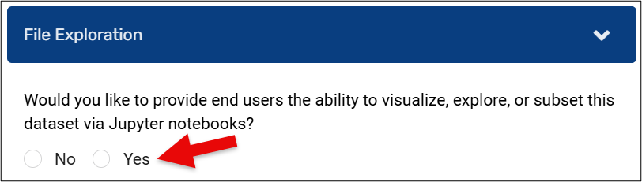
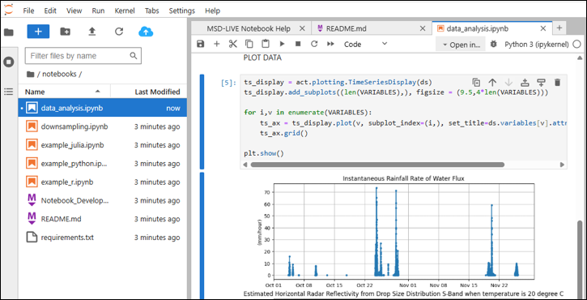

# Exploring Datasets via Jupyter Notebooks

MSD-LIVE allows users to **interactively explore data** in the MSD-LIVE data repository using Jupyter Notebooks within MSD-LIVE's Notebook Lab. This feature lets users explore, analyze, and subset datasets directly in the cloud without downloading files locally.

  <iframe width="560" height="315"
      src="https://www.youtube.com/embed/pSuCXRqsTGQ"
      frameborder="0" allowfullscreen>
  </iframe>

This page provides an overview of how the dataset notebook feature works from the perspective of both a dataset author and a downstream user.

Dataset authors adding data to the MSD-LIVE data repository can link the dataset to a code repository with pre-packaged Jupyter notebooks to explore the data.  
Downstream users can also open blank Jupyter Notebooks and write their own analysis, visualization, or subsetting routines. Subsets or processed data can be downloaded directly from the cloud via the Jupyter Notebook user interface or MSD-LIVE's [**Command-Line Interface (CLI)**](https://msdlive.org/cli-help).

---

## How It Works

Watch this video for an overview of the workflow for using MSD-LIVE's dataset notebooks feature:

  <iframe width="560" height="315"
      src="https://www.youtube.com/embed/7DOLFdx5eNA"
      frameborder="0" allowfullscreen>
  </iframe>

---

## Components

### Dataset Authors: Enabling File Exploration

As a dataset author, you can choose to enable interactive Jupyter Notebook file exploration when creating or editing a record in the MSD-LIVE data repository. There are a few things you should keep in mind when enabling this feature:

- Upload raw files in their original format (e.g., `.csv`, `.netcdf`)
- File types should be readable in Jupyter Notebooks
- No zipped archives
- Select **"Yes"** to the question:  
  *“Would you like to provide end users the ability to visualize, explore, or subset this dataset via Jupyter Notebooks?”*

**For more detailed help enabling file exploration, visit:**  
[**How to Enable File Exploration**](enable_exploration.md)

---

Dataset authors have the option to provide pre-packaged code designed to assist downstream users in exploring the data. For example, data visualization notebooks used to generate quick-look plots of the data. This is an optional step. If you enable file exploration for your data but do not provide pre-packaged code downstream users will still have the option to open blank Jupyter Notebooks to write their own analysis, visualization, or subsetting routines.

**For more detailed help, visit:**  
[**How to Provide Pre-Packaged Code**](prepackaged_code.md)

[**Using MSD-LIVE's Notebook Lab**](notebook_lab.md)

---

Downstream users can explore data in MSD-LIVE by browsing the data repository. If a dataset in the repository supports interactive dataset notebooks, you’ll see an "Explore the Data" button on the dataset’s landing page. What happens when you click the link?

- A Jupyter Notebook environment spins up in the AWS cloud.
- The dataset's files are accessible in a mounted `data/` folder.
- If provided by the dataset author, the GitHub repo containing the pre-packaged code is cloned into the environment.

Once in your Jupyter Notebook environment there are multiple ways to explore the data and interact with it via code:
- Open example notebooks and follow the provided instructions.
- Write your own notebooks using Python, R, or Julia.
- Visualize, analyze, or subset the data.
- Copy files to your scratch directory and download them via the MSD-LIVE command-line interface.

**For more detailed help, visit:**  
[**Using MSD-LIVE's Dataset Notebooks**](using_notebooks.md)

[**Creating Dataset Notebooks**](create_notebooks.md)

[**Copying Files to Your Scratch Directory**](using_notebooks.md#scratch-dir)

---

## Other Resources

- MSD-LIVE's GitHub [repository template](https://github.com/MSD-LIVE/template-dataset-jupyter-notebook) to use when enabling file exploration
- Example dataset with [file exploration enabled](https://data.msdlive.org/records/6yawb-zyx60) and its [accompanying notebook environment](https://notebook.dev.msdlive.org/?dataset_id=kw4st-brm23)
- Helpful Resource Links
    - [How to Enable File Exploration](enable_exploration.md)
    - [How to Provide Pre-Packaged Code](prepackaged_code.md)
    - [Using MSD-LIVE's Notebook Lab](notebook_lab.md)
    - [Using MSD-LIVE's Dataset Notebooks](using_notebooks.md)
    - [Creating Dataset Notebooks](create_notebooks.md)
    - [Copying Files to Your Scratch Directory](using_notebooks.md#scratch-dir)
