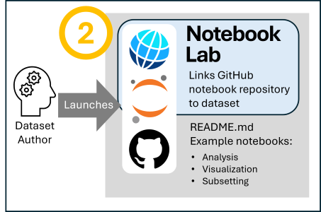
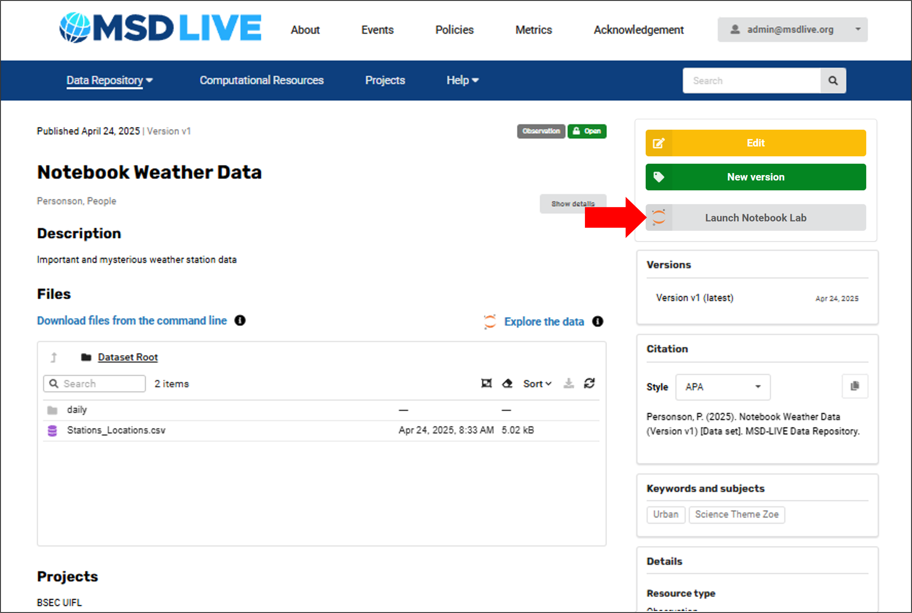
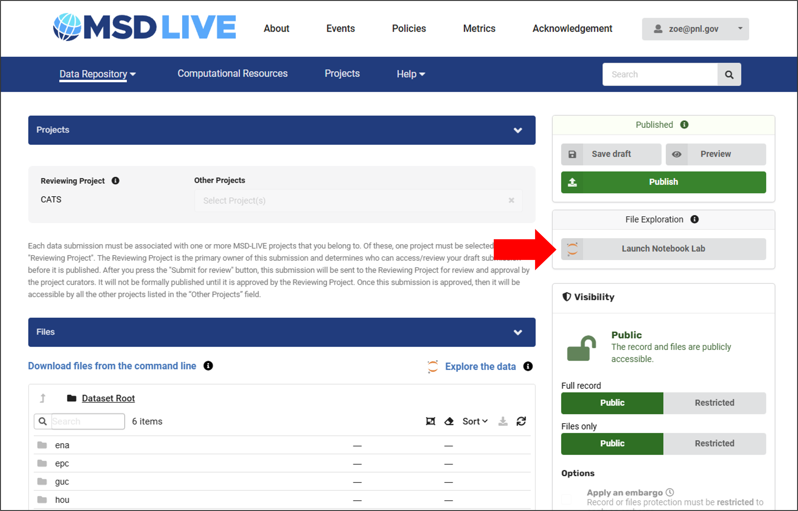
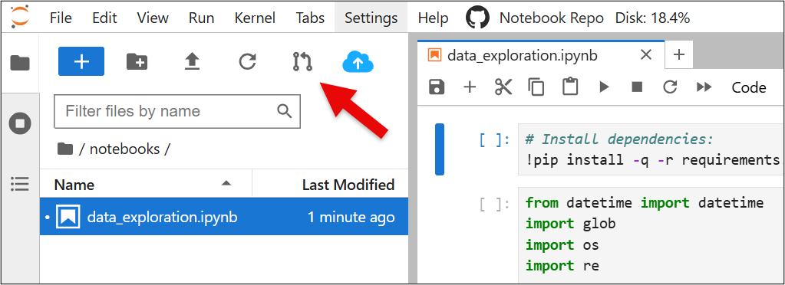

# Using MSD-Live's Notebook Lab

The second component of MSD-LIVE's dataset notebooks feature is the ability to provide pre-packaged code written by the dataset author. See [Exploring Datasets via Jupyter Notebooks](index.md) for an overview of related dataset notebook features.

Watch this video to see how to use the Notebook Lab environment

  <iframe width="560" height="315"
      src="https://youtube.com/embed/00Rm65PTsn8"
      frameborder="0" allowfullscreen>
  </iframe>

## Features of the Notebook Lab

- **No local setup required:** The authoring environment automatically spawns a fully-configured Jupyter server for you in the cloud - no need to install Python, Jupyter, or any dependencies locally

- **Pre-mounted data:** Your dataset files are automatically available

- **Instant access:** Start coding and executing cells immediately - everything you need is already set up

- **GitHub integration:** Create pull requests directly from the Jupyter Notebook environment and share notebooks with project members for review

## How To Use MSD-LIVE's Notebook Lab:

### Prerequisites
- A draft or published dataset in MSD-LIVE with:
    - The data uploaded
    - File exploration enabled on the dataset
    - A GitHub repository linked

- Basic knowledge of Jupyter Notebooks and your chosen programming language

**1. Launch the Notebook Lab**
1. Log in to MSD-LIVE's data repository
2. Navigate to your draft or published dataset that has file exploration enabled
3. Click "Launch Notebook Lab"
4. Log in with your MSD-LIVE credentials

Your Notebook Lab can be launched from a published or draft dataset's landing page:

Or, from the File Exploration section of your draft once your GitHub repo has been linked:

!!! important

    Be sure to save often as our MSD-LIVE's Notebook Lab session is limited to 3 hours

### Create Notebooks
Create notebooks following the steps in this guide:

### Save Your Notebooks to Your GitHub Repository
Your Notebook Lab environment comes with the following GitHub integrations.

1. Automatic repository setup:
    - When your Notebook Lab launches for a dataset for the first time, we automatically clone the GitHub repository you specified in the "File Exploration" section
    - The repository is cloned into your home directory under the notebooks folder

2. Create and edit notebooks:
    - Work on your notebooks inside the notebooks folder
    - Your files persist across notebook sessions for this dataset - you won't lose your work when you close and reopen the environment
    - Your Jupyter Notebook server session is limited to 3 hours so be sure to save often

3. Push changes to GitHub:
    - When your notebooks are complete, click the "Pull Request" button in the interface
    - If this is your first time, you'll be prompted to authorize MSD-LIVE to access your GitHub repository
    - Once authorized, MSD-LIVE will create a pull request on your behalf with your new files and changes

### Authorization process:

- The first time you use the pull request feature, you'll need to grant MSD-LIVE permission to make pull requests to your repository
- This is a one-time setup that allows MSD-LIVE to push your notebook changes directly to your GitHub repo
- You maintain full control - you can review and merge the pull requests as usual on GitHub

### Manage Your Home Directory

!!! important

    - Your home directory has a 50 GB quota
    - Files older than 7 days in your home directory are automatically deleted

### Storage Quota

  - Limit: 50 GB per user per dataset
  - Dataset files (files mounted under /data and symlinked in your home folder as data) are excluded from the quota
  - MSD-LIVE has daily monitoring with email alerts if exceeded
  - You can manage your storage quota usage by cleaning up old files

### Automated Cleanup

Files older than 7 days are automatically deleted to maintain system performance.

**What gets deleted:**

- Temporary files (.tmp, .log, .cache, .bak)
- Data files (.csv, .json, .pkl, .zip, etc.)
- Large files over 100 MB
- Files with "temp", "cache", or "backup" in the name

**What's protected:**

- Configuration directories (.jupyter, .ssh, .git, etc.)
- Recently accessed Jupyter Notebooks
- Any file accessed within 7 days
- Your dataset's data mounted at /data is never deleted

**Advance warning:**

- MSD-LIVE will send you email notification 3 days before deletion
- Simply open a file to protect it for another 7 days

**Best practices:**

- Use the Pull Request button to push changes back to your GitHub repo
- Complete your dataset notebook development within 1 week

