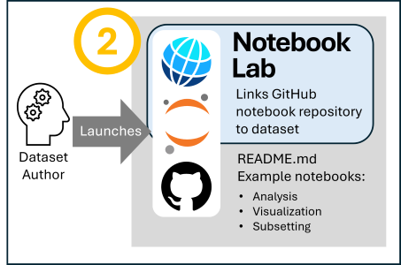
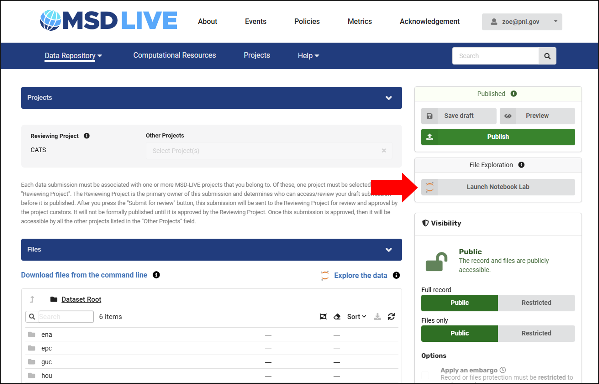
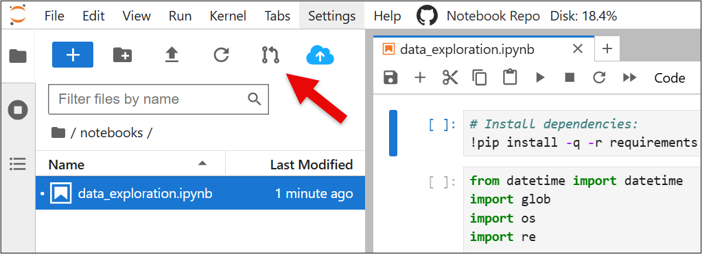

# Notebook Lab for Dataset Authors

This guide is intended for **dataset authors** who want to create and maintain example notebooks using MSD-LIVE’s cloud-based Notebook Lab. See [Exploring Datasets via Jupyter Notebooks](/dataset_notebooks/overview) for an overview of all dataset notebook features.

## Video Overview: Notebook Lab Demo
Watch this short demo to see how authors use the Notebook Lab environment.

  <iframe width="560" height="315"
      src="https://youtube.com/embed/00Rm65PTsn8"
      frameborder="0" allowfullscreen>
  </iframe>

## What the Notebook Lab Provides

- **No local setup required:** A fully configured Jupyter server is launched automatically in the cloud—no Python or Jupyter installation needed.
- **Pre-mounted dataset files:** Your dataset files are immediately available in the notebook environment.
- **Instant productivity:** Start writing and executing code as soon as the environment loads.
- **Built-in GitHub workflow:** Create pull requests directly from the Notebook Lab and share notebooks for review.

## Using the Notebook Lab

**Launch the Notebook Lab**

1. Log in to MSD-LIVE’s data repository
2. Navigate to your draft or published dataset with File Exploration enabled
3. Click **Launch Notebook Lab**
4. Log in using your MSD-LIVE credentials

You can launch the Notebook Lab from a published or draft dataset’s landing page:

Or from the File Exploration section once your GitHub repository is linked:

!!! important
    Notebook Lab sessions are limited to **3 hours**. Be sure to save your work frequently.

### Creating New Notebooks

After the environment loads, right-click in the file explorer and select **New Notebook**.

When creating a notebook, you’ll be asked to choose where it lives. This determines how it’s shared and reviewed.

- **If the dataset has a linked GitHub repository:**
    - Choose a notebook location:
        - *Community Notebooks* for general or cross-dataset notebooks
        - *Dataset Notebooks* for dataset-specific notebooks
    - Optionally select **Create notebook with starter code and dataset guidance**

- **If the dataset does not have a linked repository:**
    - Only the starter code option is available
    - Select it to pre-fill the notebook with examples and environment guidance

### Saving and Syncing Notebooks with GitHub

Notebook Lab includes built-in GitHub integration to manage your work.

#### Automatic Repository Setup
- The first time you launch Notebook Lab for a dataset, MSD-LIVE automatically clones the linked GitHub repository
- The repository is placed in your home directory under the `notebooks` folder

#### Editing and Persisting Notebooks
- Create and edit notebooks inside the `notebooks` folder
- Files persist across Notebook Lab sessions for the same dataset
- Sessions expire after 3 hours, so save often

#### Creating a Pull Request
- Click the **Pull Request** button in the Notebook Lab interface
- On first use, authorize MSD-LIVE to access your GitHub repository
- MSD-LIVE creates a pull request containing your new or updated notebooks

### GitHub Authorization and Permissions

- Authorization is required the first time you use the pull request feature
- This is a one-time setup that allows MSD-LIVE to push changes on your behalf
- You retain full control—review and merge pull requests directly on GitHub
