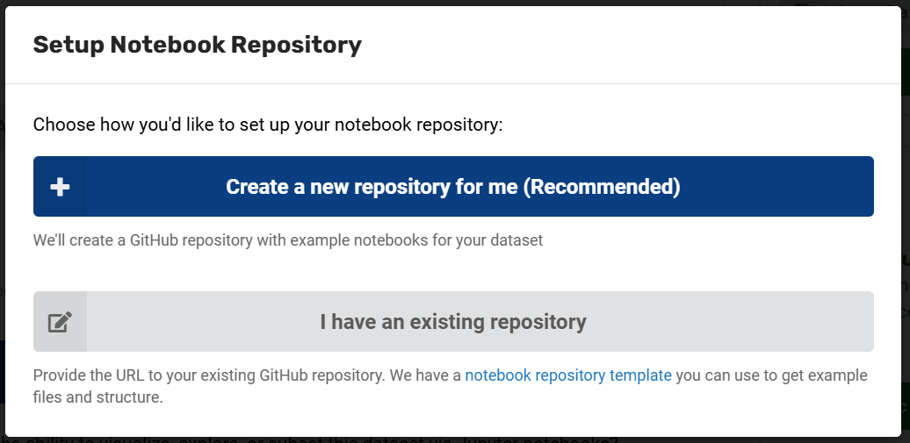

# Dataset Authors: Providing Pre-Packaged Code

The second component of MSD-LIVE's dataset notebooks feature is the ability to provide pre-packaged code written by the dataset author. See Exploring Datasets via Jupyter Notebooks for an overview of related dataset notebook features.

  <iframe width="560" height="315"
      src="https://youtube.com/embed/sImLLAIGmhk"
      frameborder="0" allowfullscreen>
  </iframe>

Dataset authors have the option to provide pre-packaged code designed to assist downstream users in exploring the data. For example, data visualization notebooks used to generate quick-look plots of the data. This is an optional step. If you enable file exploration for your data but do not provide pre-packaged code downstream users will still have the option to open blank Jupyter Notebooks to write their own analysis, visualization, or subsetting routines.

## Setup Your Notebook Repository

MSD-LIVE provides an automated workflow to help you set up a GitHub repository for your dataset's notebooks. To set up your repo, you have two options:

**Option A: Automated Repository Creation (Recommended)**

1. Click the "Setup Repository" button in the File Exploration section

2. In the modal that opens, select "Create a new repository for me (Recommended)"

3. If this is your first time, you'll be prompted to authorize MSD-LIVE to access your GitHub account:

    - Click "Connect with GitHub"
    - Visit the GitHub authorization URL that appears
    - Enter the provided authorization code
    - Once authorized, click "Next" to proceed

4. Select the owner (typically a project in GitHub) and enter a name for your new repository

5. Click "Create Repository"

6. Your new repository will be created automatically with example notebooks and the URL will be added to your record

**Option B: Use an Existing Repository**

1. Click the "Setup Repository" button in the File Exploration section

2. Select "I have an existing repository"

3. Enter the URL of your existing GitHub repository

4. Click "Add Repository"

**Repository Template**

Whether you create a new repository or use an existing one, we recommend using our [notebook repository template](https://github.com/MSD-LIVE/template-dataset-jupyter-notebook) as a reference for structure and example files.

## Create Your Notebooks
After your data has been uploaded to your MSD-LIVE dataset and the notebook GitHub repository has been linked, you have two options for creating notebooks:

**Option A: Upload notebooks directly**

- Create notebooks locally or in your preferred environment

- Upload them directly to your GitHub repository

**Option B: Use our Notebook Lab environment (Recommended)**

- Access our specialized authoring environment by clicking "Launch Notebook Lab" from your dataset in MSD-LIVE. See this page for more information on how to use the Notebook Lab.

- Your dataset's data will be automatically mounted and accessible

- Built-in GitHub integration allows you to create pull requests directly from the Jupyter Notebook environment

- No need to download/upload files manually

👉 Follow these instructions to create your dataset notebooks.

## Best Practices
- Include a comprehensive README.md explaining how to use the notebooks

- Start with a data overview notebook that shows the structure and contents of your dataset

- Provide examples for common analysis tasks

- Document dependencies in the requirements.txt file
- Test your notebooks before publishing to ensure they work correctly