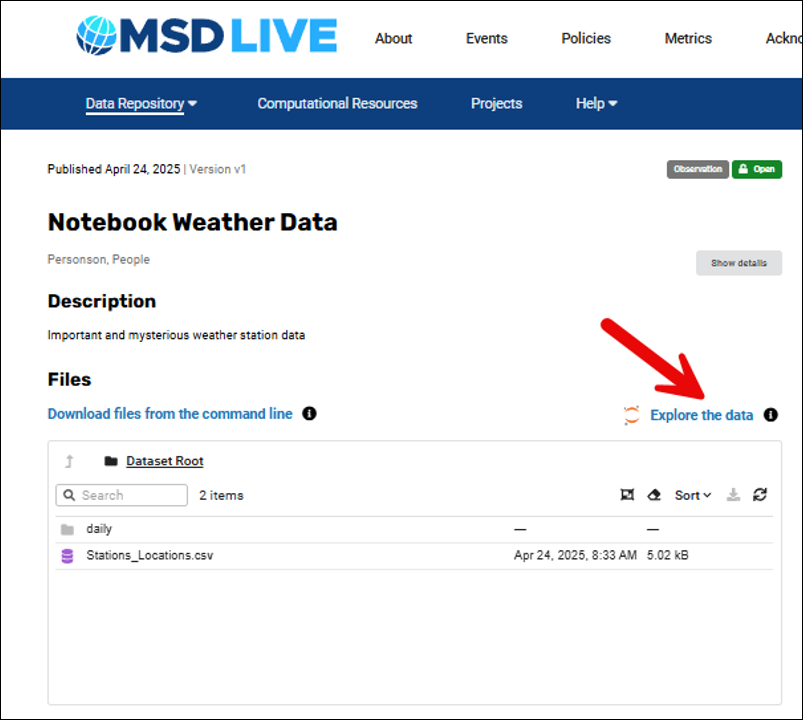
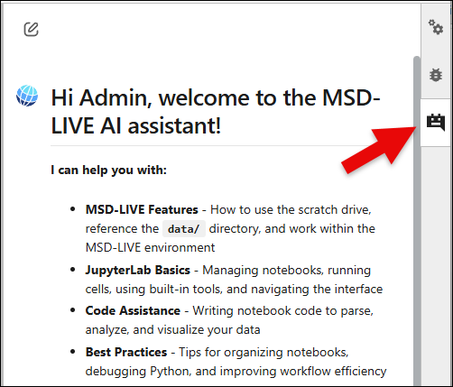
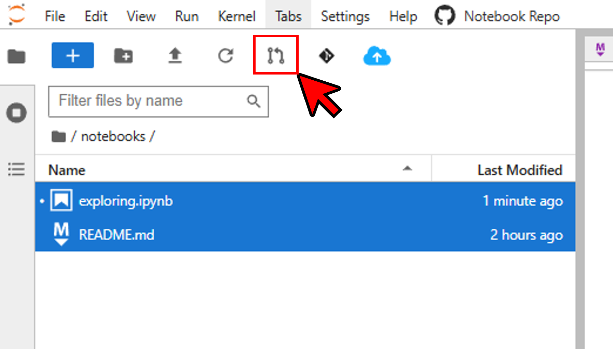
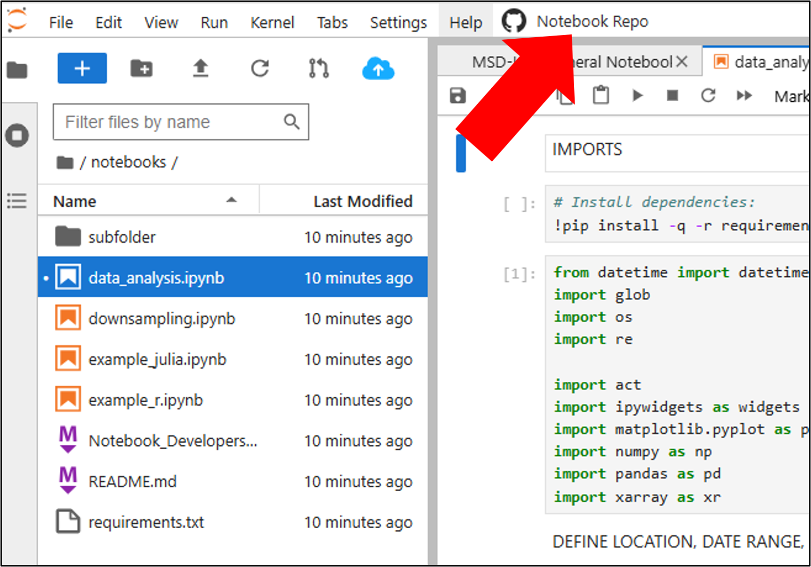
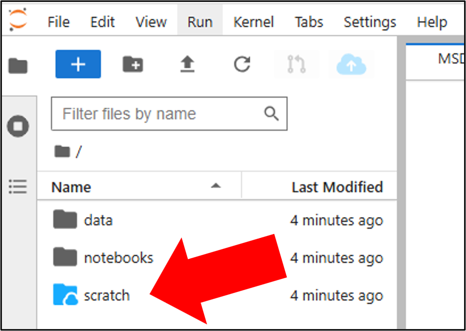

# Using MSD-LIVE's Dataset Notebooks

The fourth component of MSD-LIVE's dataset notebooks feature is the ability to run code from within Jupyter Notebooks against data mounted from a dataset. See [Exploring Datasets via Jupyter Notebooks](dataset_notebooks.md) for an overview of related dataset notebook features.

Watch this video for a full walkthrough of exploring datasets via Jupyter Notebooks.

<div style="text-align: center;">
  <iframe width="560" height="315"
      src="https://youtube.com/embed/TGFe0bD4qe8"
      frameborder="0" allowfullscreen>
  </iframe>
</div>

If a dataset owner has enabled file exploring on the dataset you will see an "Explore the data" link on the dataset's landing page. If you do not see this link that means interactive file exploring has not been enabled for the dataset. To start exploring, click this "Explore the data" link:



If the dataset author has provided pre-packaged code you will be automatically directed to a README file explaining how to use the notebooks provided by the dataset author. If no README file is available, you will need to create your own notebook to interact with the data. See the [How to Create Dataset Notebooks](create_notebooks.md) page for more instructions.

## Using the MSD-LIVE AI Assistant
Once your Jupyter notebook environment opens, you can access the MSD-LIVE AI Assistant from the right sidebar.
This built-in chatbot can help yodu as you explore and analyze your dataset. It provides:


- MSD-LIVE feature guidance — how to use the scratch directory, reference DATA_DIR and PUBLIC_DATA_DIR, and work within the environment

- JupyterLab help — running cells, managing notebooks, and navigating the interface

- Code assistance — writing Python/R/Julia code to load, inspect, analyze, and visualize your data

- Notebook best practices — organizing your workflow, debugging, and improving notebook quality

You can ask it questions at any time while working with your dataset.

---

The key features of using MSD-LIVE's Jupyter Notebooks for data exploration are outlined below. An [example dataset with file exploration enabled](https://data.msdlive.org/records/6yawb-zyx60) and its accompanying [notebook environment](https://notebook.msdlive.org/?dataset_id=6yawb-zyx60) is also provided so you can see these features in action.

Here are some common help topics:
- How to install and use dependencies

- How to access multiple datasets

- How to contribute back notebooks

- About the scratch directory

- How to copy files into your scratch directory

- How to download files from your scratch directory using our CLI

!!! note

    When exploring data via Jupyter Notebooks in MSD-LIVE, your session is limited to 1 hour

---

## Installing and using dependencies in a notebook

In Jupyter Notebooks, you can install and use external packages directly from within a code cell - no need to leave the notebook!. Here's how you can do it for Python, R, and Julia notebooks.

=== "Python"

    1. Install the package (run this in a Python cell):

        ```
        !pip install polars --quiet
        ```

    2. Import necessary packages:

        ```python
        import polars as pl
        import os
        from pathlib import Path
        import pandas as pd
        import seaborn as sns
        import matplotlib.pyplot as plt
        ```

    3. Inspect Dataset Directory

        ```python
        data_dir = Path(os.environ['DATA_DIR'])
        print('DATA_DIR =', data_dir)

        print('\nListing via DATA_DIR:')
        for p in data_dir.iterdir():
            print(' -', p.name)

        csvs = sorted(data_dir.glob('*.csv'))
        df = None
        if csvs:
            first = csvs[0]
            print(f"\nAttempting to load {first.name} ...")
            df = pd.read_csv(first)
            
            if df is not None:
                print('Shape =', df.shape)
                display(df.head())
        ```

    4. Polars Conversion and Summary

        ```python
        if 'df' in locals() and isinstance(df, pd.DataFrame) and df is not None:
          pl_df = pl.from_pandas(df)
          print('Converted pandas DataFrame to polars shape =', pl_df.shape)
          print(pl_df.head())
          print('\nColumn means:')
          print(pl_df.select(pl.all().mean()))
        ```
        Converts the pandas DataFrame (df) to a Polars DataFrame (pl_df), displays the first rows, and computes simple column means using Polars expressions.

    5. Access another dataset by its Record ID

        ```python
        import os
        from pathlib import Path

        # PUBLIC_DATA_DIR points to all public datasets with file exploration enabled
        public_dir = Path(os.environ['PUBLIC_DATA_DIR'])
        print("PUBLIC_DATA_DIR =", public_dir)

        # Access another dataset by its Record ID
        # we can access another dataset's data by using its Record ID as the path under public_datasets
        other_dataset_id = "6yawb-zyx60"  
        other_data_path = public_dir / other_dataset_id

        print(f"Files available in dataset {other_dataset_id}:")
        for f in other_data_path.iterdir():
            print(" -", f.name)
        ```


=== "R"

    1. Install the package (run this in an R Cell)

      ```r
      install.packages(c('tidyverse','data.table'), repos='https://cloud.r-project.org')
      ```

    2. Load the package

      ```r
      library(tidyverse)
      library(data.table)
      packageVersion('tidyverse'); packageVersion('data.table')
      ```

      This will create a scatter plot of weight vs. miles per gallon from the built-in mtcars dataset

    3. Inspect Dataset Directory

      ```r
      data_dir <- Sys.getenv('DATA_DIR')
      if (data_dir == '' || !dir.exists(data_dir)) {
        message('DATA_DIR not set or missing. Falling back to /data')
        data_dir <- '/data'
      }
      cat('Using data directory:', data_dir, '\n')

      cat('\nListing via data_dir:\n')
      print(list.files(data_dir))
      cat('\nListing via /data:\n')
      print(if (dir.exists('/data')) list.files('/data') else '(/data not found)')

      # Example: read first CSV if available (pattern fixed: use "[.]csv$" to avoid escape issues)
      csvs <- list.files(data_dir, pattern='[.]csv$', full.names=TRUE, ignore.case=TRUE)
      if (length(csvs) > 0) {
        cat('\nFound CSV files:\n'); print(basename(csvs))
        first <- csvs[1]
        dt <- data.table::fread(first)
        cat('\nLoaded', basename(first), 'dim =', paste(dim(dt), collapse='x'), '\n')
        print(head(dt))
      } else {
        cat('\nNo CSV files found matching *.csv in', data_dir, '\n')
      }
      ```

    4. Access another dataset by its Record ID

      ```r
      # PUBLIC_DATA_DIR points to all public datasets with file exploration enabled
      public_dir <- Sys.getenv('PUBLIC_DATA_DIR')
      cat("PUBLIC_DATA_DIR =", public_dir, "\n")

      # Access another dataset by its Record ID
      # we can access another dataset's data by using its Record ID as the path under public_datasets
      other_dataset_id <- "6yawb-zyx60"  
      other_data_path <- file.path(public_dir, other_dataset_id)

      cat("Files available in dataset", other_dataset_id, ":\n")
      print(list.files(other_data_path))
      ```


=== "Julia"

    1. Install the package (run these in a Julia cell):

      ```julia
      import Pkg;
      Pkg.add([
          "DataFrames",
          "CSV",
          "Plots"
      ]);
      ```

    2. Load and use the package data manipulation and plotting:

      ```julia
      using DataFrames, CSV, Plots
      @info "DataFrames version" DataFrames.VERSION
      ```

    3. Inspect Dataset Directory

      ```julia
      data_dir = ENV["DATA_DIR"]
      println("DATA_DIR = $(data_dir)")
      println("\nListing via DATA_DIR:")
      for f in readdir(data_dir)
          println(" - ", f)
      end
      println("\nListing via /data:")
      for f in readdir("/data")
          println(" - ", f)
      end

      csvs = filter(f -> endswith(lowercase(f), ".csv"), readdir(data_dir; join=true))
      if !isempty(csvs)
          df = CSV.read(first(csvs), DataFrame)
          println("\nLoaded 
      (size(df))")
          first(df, 5)
      else
          println("\nNo CSV files found.")
      end
      ```
    Use ENV["DATA_DIR"] (preferred) and /data to list files. Attempts to read a CSV if present.

    4. Acccess another dataset by its Record ID

      ```julia
      # PUBLIC_DATA_DIR points to all public datasets with file exploration enabled
      public_dir = ENV["PUBLIC_DATA_DIR"]
      println("PUBLIC_DATA_DIR = $(public_dir)")

      # Access another dataset by its Record ID
      # we can access another dataset's data by using its Record ID as the path under public_datasets
      other_dataset_id = "6yawb-zyx60"  
      other_data_path = joinpath(public_dir, other_dataset_id)

      println("Files available in dataset $other_dataset_id:")
      for f in readdir(other_data_path)
          println(" - ", f)
      end
      ```

!!!note
    
    - You typically only need to install a package once per environment

    - If your environment resets or changes, you may need to reinstall

    - Some restricted environments may prevent installation of certain packages

---
### Accessing Multiple Datasets from Any Notebook Server

MSD-LIVE supports exploring multiple datasets from the same Jupyter notebook server using the public_datasets feature.

Key points:

1. From any dataset’s Jupyter notebook server, you can access all published, public datasets that have enabled file exploration via the /public_datasets directory.

2. Only datasets with file exploration enabled are available here.

3. The Record ID can be found on the dataset’s public landing page, in the details section.

4. A symbolic link named public_datasets is included in your Jupyter home directory (similar to /data) pointing to /public_datasets.

5. A PUBLIC_DATA_DIR environment variable is now available in your Jupyter server, similar to DATA_DIR.

---
### Contributing Back
MSD-LIVE's dataset exploration environment includes a powerful collaboration feature that lets users contribute improvements back to the platform. If you create useful analysis or visualization notebooks, you can submit a GitHub Pull Request (PR) so others can benefit from your work.

### Pull Request


When exploring a dataset, you’ll see a **Pull Request** button in the JupyterLab toolbar. You can use it to contribute new notebooks or updates to existing ones.

**Where your PR goes**
- If your notebook is in /notebooks (dataset-specific notebooks):
Your PR is sent to the dataset owner for review.

- If your notebook is in /community_notebooks (shared community notebooks):
Your PR is sent to MSD-LIVE administrators for review.

Community Notebooks exist so contributions can still be saved and shared even when a dataset author hasn’t linked a GitHub repository.

**How to contribute**
1. Create or modify notebooks in your environment.

2. Select the file(s) to include (CTRL-click for multiple).

3. Click Pull Request.

4. Add a brief description.

5. Submit.

Once approved, your notebook will become available to all future users who explore the dataset. This creates a collaborative ecosystem where the exploration experience continuously improves through community contributions.

### GitHub Repository Link



You'll also see a button that opens the dataset's notebook repository directly on GitHub. This allows you to:

- Browse the source code and history of the exploration notebooks

- View existing issues and discussions

**Note:** Your contributions help improve the dataset exploration experience for the entire research community of downstream users.

**Tip:** Consider contributing when you create useful visualizations, find more efficient analysis methods, or develop notebooks that address common research questions with the dataset.

**Remember**: All contributions are subject to review by the dataset author before being made available to other users.

---

### Using the Scratch Directory in Jupyter Notebooks
We’ve also included a scratch directory to help you download large files easily from your Jupyter Notebooks. The scratch directory also enables you to download files remotely when a web browser isn't available.



What is the scratch directory?
The scratch directory is:

- A symbolic link inside your Jupyter home directory

- Mounted using mount-s3 (i.e., cloud-backed)

- A temporary space: Files are automatically deleted after 1 day

- Used to download files you've created/subsetted during analysis in a notebook that are
    - large in size or quantity, or
    - needed on a remote computer that is lacking a web browser

!!!warning "Limitations"

    Because it's backed by S3:

    - Renaming files is not supported
    - Symbolic links cannot be created inside the scratch directory
    - Write speeds may be slower than writing to your local file system

**When should you use the scratch directory?**
Use the scratch directory if:

- You’ve processed or subsetted large data in your notebook

- You want to download that data outside of the Jupyter web interface (e.g., via MSD-LIVE's CLI)

- You want your data on a machine without a web browser or you're dealing with many files or large files

You can still right-click → Download in the Jupyter interface for smaller downloads, but the scratch directory is recommended for heavier lifting.

**How to copy output files to the scratch directory**
To copy your processed/subsetted files to the scratch dir from within your notebook do the following:

1. Open the File Browser (left sidebar)

2. Select the files and/or folders you want to copy
    - Use Shift+Click or Ctrl+Click (Cmd+Click on Mac) to select multiple items

3. Click the blue cloud button in the toolbar at the top of the file browser

4. A notification will appear letting you know the copy job has started

5. Once complete, you’ll receive a second notification confirming the copy finished

Here's a video of copying files to a scratch directory:

<div style="text-align: center;">
  <iframe width="560" height="315"
      src="https://youtube.com/embed/PQ4aF16puak"
      frameborder="0" allowfullscreen>
  </iframe>
</div>

!!!note "Important Note"

    Using the "Copy to Scratch Dir" button in the file explorer is the preferred and supported way to copy files into your scratch directory. While it's technically possible to copy files using code inside notebooks, this is not recommended. Due to underlying S3 limitations, doing so may cause:

    - Errors related to file timestamps

    - Permissions-related issues

    - Confusing or partial behavior

    Additionally:

    Renaming or moving files inside the scratch directory is not supported.
    If you need to change the name or location of a file, please delete it from the scratch directory and re-copy it using the Copy to Scratch Dir button.

    Stick to the provided button workflow for the best results.

### Downloading via MSD-LIVE's CLI
You can use the MSD-LIVE command-line interface (CLI) to download your scratch directory with improved performance and no need for a browser.

To get started:

1. Follow these instructions to install the MSD-LIVE CLI

2. Log in by running:
```
msdlive login
```

3. Download your scratch directory by running:
```
msdlive download --scratch --output-dir msdlive_scratch
```
Replace ```msdlive_scratch``` with a folder name or full path where you want the files saved

Watch this video for a full walkthrough of downloading your scratch directory using the CLI:
<div style="text-align: center;">
  <iframe width="560" height="315"
      src="https://youtube.com/embed/A7xMkEvV-Ms"
      frameborder="0" allowfullscreen>
  </iframe>
</div>

!!!warning "Scratch Directory Cleanup"

    Files in your scratch directory will be automatically deleted after 24 hours. Be sure to download anything you need before then.
