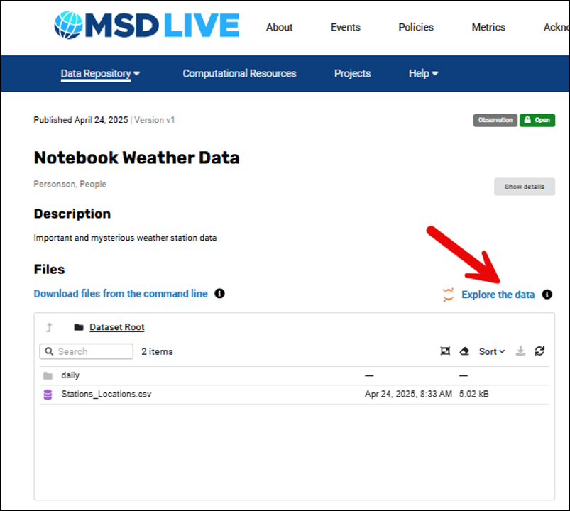
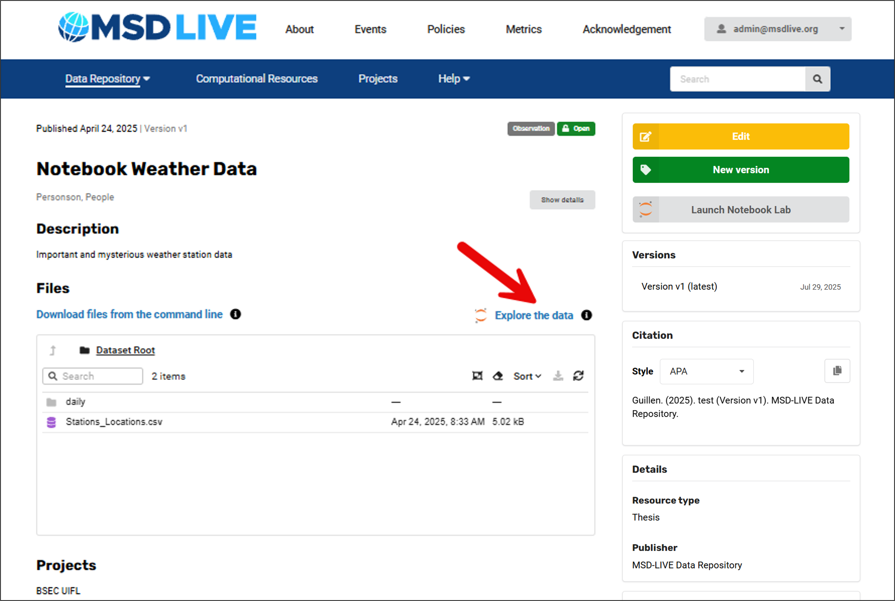
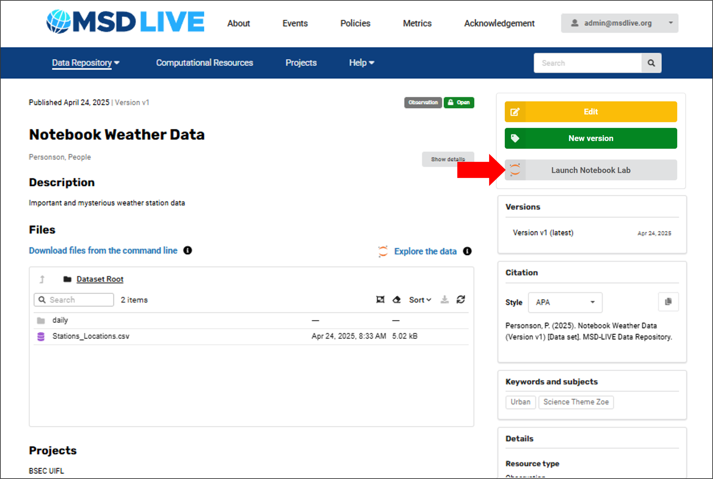
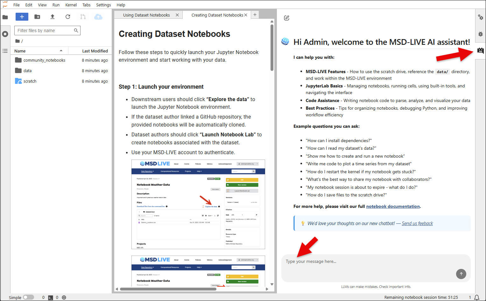
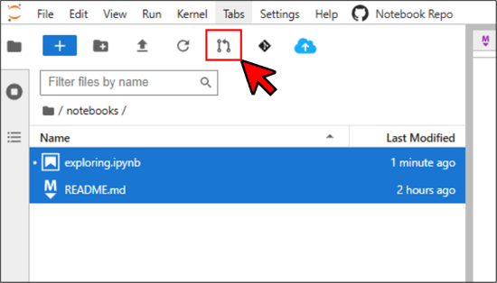
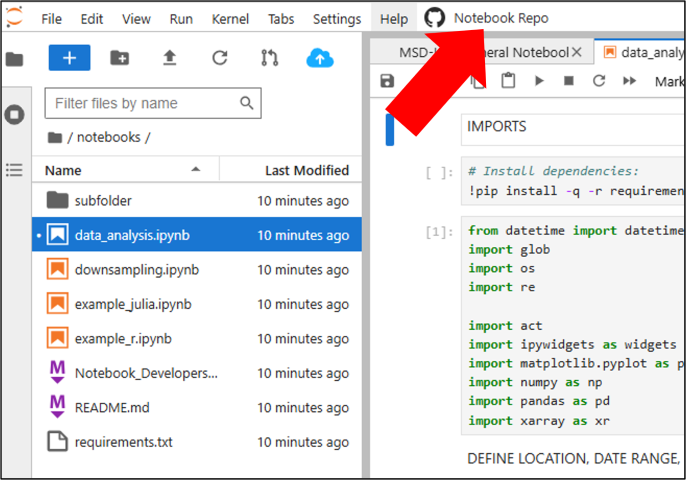

# Explore Data in Jupyter Notebooks

MSD-LIVE's dataset notebooks feature lets you run code directly within Jupyter Notebooks against data mounted from a dataset. For an overview of all dataset notebook features, see [Exploring Datasets via Jupyter Notebooks](index.md).

## Video Walkthrough

Watch this video for a full walkthrough of exploring datasets via Jupyter Notebooks:

  <iframe width="560" height="315"
      src="https://youtube.com/embed/TGFe0bD4qe8"
      frameborder="0" allowfullscreen>
  </iframe>

---

## Accessing a Dataset for Exploration

If a dataset owner has enabled file exploring, you will see an **"Explore the data"** link on the dataset's landing page.  

> **Note:** If you do not see this link, interactive file exploring has not been enabled for the dataset.

Click **"Explore the data"** to start exploring:

### Pre-Packaged Code

- If the dataset author provided pre-packaged code, you will be directed to a README explaining how to use the notebooks.
- If no README is available, you will need to create your own notebook to interact with the data.  
  See [Creating Notebooks](creating_notebooks.md) for instructions.

---

## Launching the Notebook Environment

1. Click **"Explore the data"** to launch the Jupyter Notebook environment.
2. If the dataset author linked a GitHub repository, the notebooks will be automatically cloned.
3. Dataset authors should click **"Launch Notebook Lab"** to create notebooks associated with the dataset.
4. Authenticate with your MSD-LIVE account.

---

## Using the MSD-LIVE AI Assistant

Once your environment opens, you can access the **MSD-LIVE AI Assistant** from the right sidebar.  

The AI Assistant helps with:

- **MSD-LIVE features:** Using the scratch directory, referencing `DATA_DIR` and `PUBLIC_DATA_DIR`, and working in the environment.  
- **JupyterLab help:** Running cells, managing notebooks, and navigating the interface.  
- **Code assistance:** Writing Python, R, or Julia code to load, inspect, analyze, and visualize your data.  
- **Notebook best practices:** Organizing workflow, debugging, and improving notebook quality.

You can ask questions at any time while exploring your dataset.

---

## Key Features of Dataset Notebooks

The following are common help topics and examples:

- [Working with Data](working_with_data.md) — installing dependencies, accessing datasets, and loading data.  
- [Manage Your Scratch Directory](scratch_directory.md) — using scratch space for large file downloads.  
- [Download Files via CLI](download_scratch_cli.md) — using the command-line tool to download files.  
- [Contributing Notebooks Back](#contributing-notebooks-back) — sharing your work back to the community.

!!! note 
    Jupyter Notebook sessions are limited to **1 hour**.

For an example dataset with file exploration enabled, see:  
- [Example dataset](https://data.msdlive.org/records/6yawb-zyx60)  
- [Corresponding notebook environment](https://notebook.msdlive.org/?dataset_id=6yawb-zyx60)

---

## Contributing Notebooks Back

MSD-LIVE encourages users to contribute improvements back to the platform through its powerful collaboration features. You can submit a GitHub Pull Request (PR) to share new notebooks, updates, or useful analyses and visualizations so that others can benefit from your work. Once your PR is approved, your notebook will become available to all future users who explore the dataset. This creates a collaborative ecosystem where the exploration experience continuously improves through community contributions.

### Submitting a Pull Request

1. Create or modify notebooks in your environment.  
2. Select the file(s) to include (CTRL-click for multiple).  
3. Click **Pull Request**.  
4. Add a brief description.  
5. Submit.

#### Where Your PR Goes

- **/notebooks (dataset-specific):** Sent to the dataset owner for review.  
- **/community_notebooks (shared):** Sent to MSD-LIVE administrators for review.

> **Tip:** Even if a dataset does not have a linked GitHub repo, contributions can still be shared via community notebooks.

### Browsing the Source Code Repository

- Browse the dataset’s notebook repository on GitHub.  
- View notebook history, existing issues, and discussions.

> **Remember:** All contributions are reviewed before being available to others. Contributing helps improve the experience for the entire research community.

---

