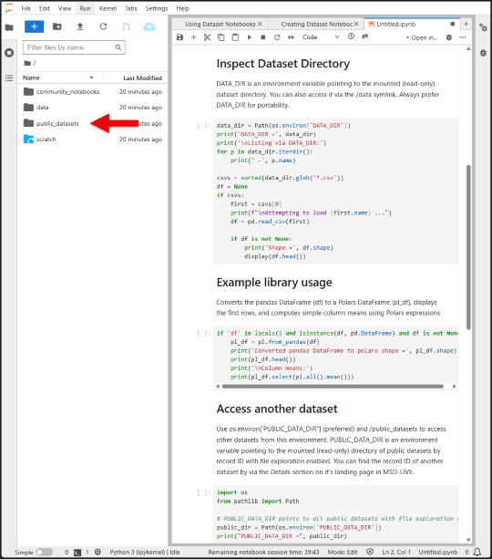
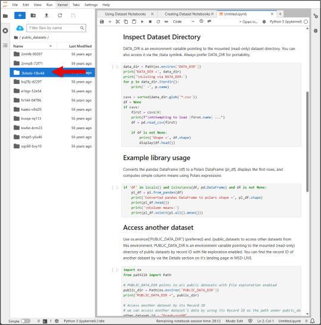
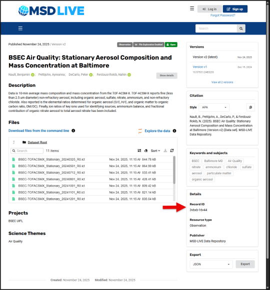

# Working with Data

Learn how to install packages, load data, and access multiple datasets in your Jupyter notebook environment.

## Installing and using dependencies in a notebook

In Jupyter Notebooks, you can install and use external packages directly from within a code cell - no need to leave the notebook! Here's how you can do it for Python, R, and Julia notebooks.

<cds-tabs trigger-content="Select an item" value="python">
  <cds-tab id="python-tab" target="panel-python" value="python">Python</cds-tab>
  <cds-tab id="r-tab" target="panel-r" value="r">R</cds-tab>
  <cds-tab id="julia-tab" target="panel-julia" value="julia">Julia</cds-tab>
</cds-tabs>

  <h3>Install the package (run this in a Python cell)</h3>
  <pre><code class="language-bash">!pip install polars --quiet</code></pre>

  <h3>Import necessary packages</h3>
  <pre><code class="language-python">import polars as pl
import os
from pathlib import Path
import pandas as pd
import seaborn as sns
import matplotlib.pyplot as plt</code></pre>

  <h3>Inspect Dataset Directory</h3>
  <pre><code class="language-python">data_dir = Path(os.environ['DATA_DIR'])
print('DATA_DIR =', data_dir)

print('\nListing via DATA_DIR:')
for p in data_dir.iterdir():
    print(' -', p.name)

csvs = sorted(data_dir.glob('*.csv'))
df = None
if csvs:
    first = csvs[0]
    print(f"\nAttempting to load {first.name} ...")
    df = pd.read_csv(first)
    
    if df is not None:
        print('Shape =', df.shape)
        display(df.head())</code></pre>

  <h3>Polars Conversion and Summary</h3>
  <pre><code class="language-python">if 'df' in locals() and isinstance(df, pd.DataFrame) and df is not None:
    pl_df = pl.from_pandas(df)
    print('Converted pandas DataFrame to polars shape =', pl_df.shape)
    print(pl_df.head())
    print('\nColumn means:')
    print(pl_df.select(pl.all().mean()))</code></pre>

  
Converts the pandas DataFrame (df) to a Polars DataFrame (pl_df), displays the first rows, and computes simple column means using Polars expressions.

  <h3>Access another dataset by its Record ID</h3>
  <pre><code class="language-python">import os
from pathlib import Path

# PUBLIC_DATA_DIR points to all public datasets with file exploration enabled
public_dir = Path(os.environ['PUBLIC_DATA_DIR'])
print("PUBLIC_DATA_DIR =", public_dir)

# Access another dataset by its Record ID
other_dataset_id = "6yawb-zyx60"
other_data_path = public_dir / other_dataset_id

print(f"Files available in dataset {other_dataset_id}:")
for f in other_data_path.iterdir():
    print(" -", f.name)</code></pre>

  <h3>Install the package (run this in an R cell)</h3>
  <pre><code class="language-r">install.packages(c('tidyverse','data.table'), repos='https://cloud.r-project.org')</code></pre>

  <h3>Load the package</h3>
  <pre><code class="language-r">library(tidyverse)
library(data.table)
packageVersion('tidyverse'); packageVersion('data.table')</code></pre>

  
This will create a scatter plot of weight vs. miles per gallon from the built-in mtcars dataset.

  <h3>Inspect Dataset Directory</h3>
  <pre><code class="language-r">data_dir <- Sys.getenv('DATA_DIR')
if (data_dir == '' || !dir.exists(data_dir)) {
  message('DATA_DIR not set or missing. Falling back to /data')
  data_dir <- '/data'
}
cat('Using data directory:', data_dir, '\n')

cat('\nListing via data_dir:\n')
print(list.files(data_dir))
cat('\nListing via /data:\n')
print(if (dir.exists('/data')) list.files('/data') else '(/data not found)')

# Example: read first CSV if available
csvs <- list.files(data_dir, pattern='[.]csv$', full.names=TRUE, ignore.case=TRUE)
if (length(csvs) > 0) {
  cat('\nFound CSV files:\n'); print(basename(csvs))
  first <- csvs[1]
  dt <- data.table::fread(first)
  cat('\nLoaded', basename(first), 'dim =', paste(dim(dt), collapse='x'), '\n')
  print(head(dt))
} else {
  cat('\nNo CSV files found matching *.csv in', data_dir, '\n')
}</code></pre>

  <h3>Access another dataset by its Record ID</h3>
  <pre><code class="language-r">public_dir <- Sys.getenv('PUBLIC_DATA_DIR')
cat("PUBLIC_DATA_DIR =", public_dir, "\n")

other_dataset_id <- "6yawb-zyx60"
other_data_path <- file.path(public_dir, other_dataset_id)

cat("Files available in dataset", other_dataset_id, ":\n")
print(list.files(other_data_path))</code></pre>

<h3>Install the package (run these in a Julia cell)</h3>
<pre><code class="language-julia">import Pkg;
Pkg.add([
    "DataFrames",
    "CSV",
    "Plots"
]);</code></pre>

<h3>Load and use packages</h3>
<pre><code class="language-julia">using DataFrames, CSV, Plots
@info "DataFrames version" DataFrames.VERSION</code></pre>

<h3>Inspect Dataset Directory</h3>
<pre><code class="language-julia">data_dir = ENV["DATA_DIR"]
println("DATA_DIR = $(data_dir)")
println("\nListing via DATA_DIR:")
for f in readdir(data_dir)
    println(" - ", f)
end
println("\nListing via /data:")
for f in readdir("/data")
    println(" - ", f)
end

csvs = filter(f -> endswith(lowercase(f), ".csv"), readdir(data_dir; join=true))
if !isempty(csvs)
    df = CSV.read(first(csvs), DataFrame)
    println("\nLoaded $(size(df))")
    first(df, 5)
else
    println("\nNo CSV files found.")
end</code></pre>

<h3>Access another dataset by its Record ID</h3>
<pre><code class="language-julia">public_dir = ENV["PUBLIC_DATA_DIR"]
println("PUBLIC_DATA_DIR = $(public_dir)")

other_dataset_id = "6yawb-zyx60"
other_data_path = joinpath(public_dir, other_dataset_id)

println("Files available in dataset $other_dataset_id:")
for f in readdir(other_data_path)
    println(" - ", f)
end</code></pre>

!!! note
    
    - You typically only need to install a package once per environment

    - If your environment resets or changes, you may need to reinstall

    - Some restricted environments may prevent installation of certain packages

---

## Accessing Multiple Datasets from Any Notebook Server

MSD-LIVE supports exploring multiple datasets from the same Jupyter notebook server using the public_datasets feature.

Key points:

1. From any dataset's Jupyter notebook server, you can access all published, public datasets that have enabled file exploration via the /public_datasets directory. 

    

2. Only datasets with file exploration enabled are available here. 

    

3. The Record ID can be found on the dataset's public landing page, in the details section.

    

4. A symbolic link named public_datasets is included in your Jupyter home directory (similar to /data) pointing to /public_datasets.

5. A PUBLIC_DATA_DIR environment variable is now available in your Jupyter server, similar to DATA_DIR.
