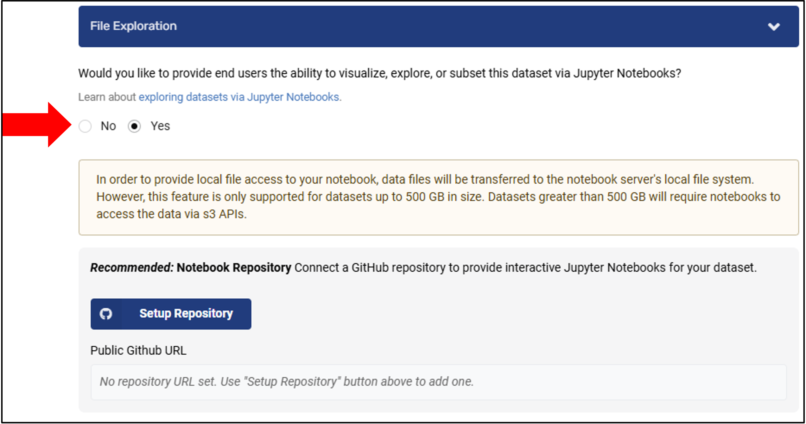

# Enable Data Exploration

Enabling file exploration marks your dataset as explorable, allowing users to browse and analyze your files through **Explore the Data** in a notebook environment. 

## What Exploration Includes

- **Interactive file browsing** — users can see and preview dataset files in a Jupyter Notebook environment
- **Pre-packaged notebooks** — you can provide example analyses (visualization, subsetting, statistical summaries) that users can run or modify
- **Custom analysis tools** — users can write their own code to explore and transform the data
- **Multiple languages** — choose between Python, R, or Julia for your analysis environment

!!! warning "Before you start:"

    - All dataset files must be uploaded to the MSD-LIVE data repository first
    - Files must be in their original format (not zipped)
    - File types must be readable in Jupyter Notebooks, such as `.csv`, `.netcdf`, `.txt`, and similar formats
    - You must be the dataset author/owner

## How to Enable File Exploration

1. Navigate to your dataset's edit page
2. Find the **File Exploration** section
3. Select **Yes** to enable interactive file exploration for users
4. (Optional) If you want to provide example notebooks, set up a linked GitHub repository — see [Set Up a Notebook Repository](setup_notebook_repository.md)
5. Submit your dataset for review and publication through the standard MSD-LIVE workflow

## Video Walkthrough

Watch this video for a quick overview of the full workflow:

  <iframe width="560" height="315"
      src="https://www.youtube.com/embed/GjbYZ12k2aM"
      frameborder="0" allowfullscreen>
  </iframe>

