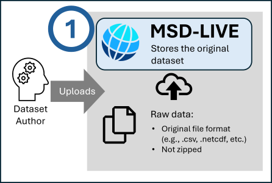

# Enable Data Exploration

The first step to providing interactive exploration is uploading raw data files and enabling this feature on your dataset.

Watch this video to see how to enable file exploration:

  <iframe width="560" height="315"
      src="https://youtube.com/embed/GjbYZ12k2aM"
      frameborder="0" allowfullscreen>
  </iframe>

## Requirements

!!! note

    Only datasets with files uploaded directly into the MSD-LIVE data repository can have file exploration enabled.

    **Important:**

    - Upload files in their original format — do not zip them
    - File types must be readable and parsable by Jupyter Notebooks, such as .csv, .netcdf, and similar supported formats

## Steps to Enable

1. Navigate to your dataset's edit page
2. Find the "File Exploration" section
3. Select "Yes" to provide users notebook functionality
4. Choose your preferred kernel (Python, R, or Julia)
5. (Optional) Setup the dataset notebook GitHub repository to house notebooks you provide

## Next Steps

After enabling file exploration:

- [Set up a notebook repository](setup_notebook_repository.md) to provide example notebooks (optional)
- [Use Notebook Lab](use_notebook_lab.md) to create notebooks for your dataset
