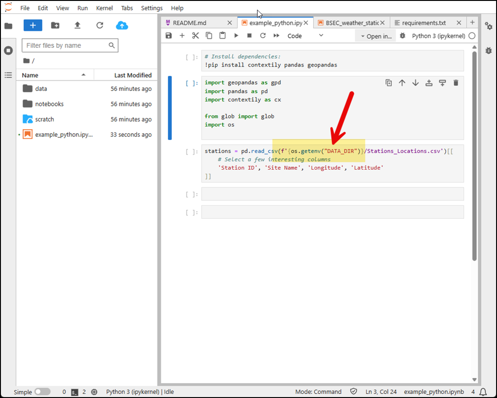

# Load Data


When creating example notebooks, demonstrate to users how to access and load your dataset.

## Accessing Your Dataset

Use the **"DATA_DIR"** environment variable to access the location where your dataset is mounted.



## Example Code for Your Notebooks

Include examples like these in your notebooks to show users how to load data:

=== "Python"

	```python
	import os
	from pathlib import Path
	import pandas as pd

	data_dir = Path(os.environ['DATA_DIR'])
	print('DATA_DIR =', data_dir)

	print('\nListing via DATA_DIR:')
	for p in data_dir.iterdir():
		print(' -', p.name)

	# Example: load a CSV if available
	csvs = sorted(data_dir.glob('*.csv'))
	if csvs:
		first = csvs[0]
		print(f"\nLoading {first.name} ...")
		df = pd.read_csv(first)
		print('Shape =', df.shape)
		display(df.head())
	```

=== "R"

	```r
	data_dir <- Sys.getenv('DATA_DIR')
	if (data_dir == '' || !dir.exists(data_dir)) {
	  message('DATA_DIR not set or missing. Falling back to /data')
	  data_dir <- '/data'
	}
	cat('Using data directory:', data_dir, '\n')

	cat('\nListing via data_dir:\n')
	print(list.files(data_dir))

	# Example: read first CSV if available
	csvs <- list.files(data_dir, pattern='[.]csv$', full.names=TRUE, ignore.case=TRUE)
	if (length(csvs) > 0) {
	  cat('\nFound CSV files:\n'); print(basename(csvs))
	  first <- csvs[1]
	  dt <- data.table::fread(first)
	  cat('\nLoaded', basename(first), 'dim =', paste(dim(dt), collapse='x'), '\n')
	  print(head(dt))
	}
	```

=== "Julia"

	```julia
	using DataFrames, CSV

	data_dir = ENV["DATA_DIR"]
	println("DATA_DIR = $(data_dir)")
    
	println("\nListing via DATA_DIR:")
	for f in readdir(data_dir)
		println(" - ", f)
	end

	# Example: load a CSV if available
	csvs = filter(f -> endswith(lowercase(f), ".csv"), readdir(data_dir; join=true))
	if !isempty(csvs)
		df = CSV.read(first(csvs), DataFrame)
		println("\nLoaded $(size(df))")
		first(df, 5)
	end
	```

## Best Practices

- Show users how to list and inspect the dataset contents
- Demonstrate loading the most common file types in your dataset
- Include error handling for missing files or incorrect paths
- Explain the structure and organization of your data files
