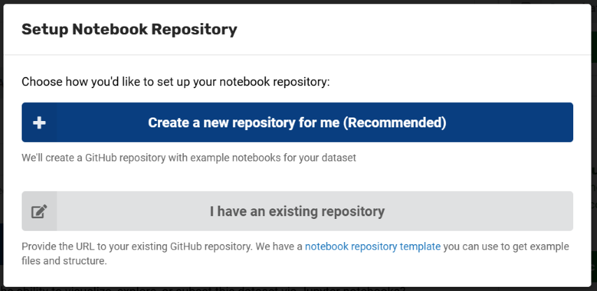

# Set Up a Notebook Repository

To provide pre-packaged example notebooks for your dataset, set up and link a GitHub repository from the **File Exploration** section of your record. When users click **Explore the Data**, notebooks from that linked repository are included in their environment.

!!! warning "Before you start:"

    - You must have a GitHub account
    - You should be familiar with basic Git/GitHub workflows (creating repos, committing code)
    - Refer to the [MSD-LIVE GitHub template repository](https://github.com/MSD-LIVE/template-dataset-jupyter-notebook) for the recommended folder structure and configuration

## Create the Repository
There are two ways to set up your notebook repository. Most users should choose the automated setup (Option A), which creates and links the repository for you. Use the manual setup (Option B) only if you prefer to manage repository creation yourself.

### Option A: Automated Repository Creation (Recommended)

This is the easiest way to get a correctly configured repository with starter notebooks.

1. Open your dataset record and go to the **File Exploration** section
2. Click **Setup Repository**
3. In the modal, select **Create a new repository for me (Recommended)**
4. If prompted, authorize MSD-LIVE to access your GitHub account:
    - Click **Connect with GitHub**
    - Open the GitHub authorization URL that appears
    - Enter the provided authorization code
    - Return and click **Next**
5. Select the repository owner (typically your project organization) and enter a repository name
6. Click **Create Repository**

MSD-LIVE will create the repository, pre-populate it with starter notebooks, and automatically add the repository URL to your dataset record.

### Option B: Manual Repository Creation

If you prefer to create and manage the repository yourself:

1. Create a repository from the [MSD-LIVE template repository](https://github.com/MSD-LIVE/template-dataset-jupyter-notebook)
2. In your dataset record's **File Exploration** section, paste the GitHub repository URL into the notebook repository field
3. Save your record changes

## Manage Your Repository

### Adding New Notebooks

After your data has been uploaded to your MSD-LIVE dataset and the notebook GitHub repository has been linked, you have two options for creating notebooks.

#### Option A: Upload notebooks directly

1. Clone your repository locally
2. Create new notebooks and a README.md file
3. Commit and push to GitHub
4. The changes will be reflected the next time users open **Explore the Data**

#### Option B: Use our Notebook Lab environment (Recommended)

Use the **Notebook Lab** environment to create and manage notebooks in MSD-LIVE.

- Your dataset's data is automatically mounted and accessible
- Built-in GitHub integration allows you to create pull requests directly from the Jupyter Notebook environment
- No need to download and re-upload files manually

Our [Notebook Lab](launch_notebook_environment.md) help page provides step-by-step notebook authoring instructions.

### Reviewing Community Contributions

Users can contribute notebooks back to your dataset via pull requests. You can:

- Review pull requests from users
- Suggest changes or improvements
- Merge contributions you want to include
- Decline contributions that don't fit your dataset

See [Save Notebooks](share_notebooks.md) for more details on the pull request workflow.

