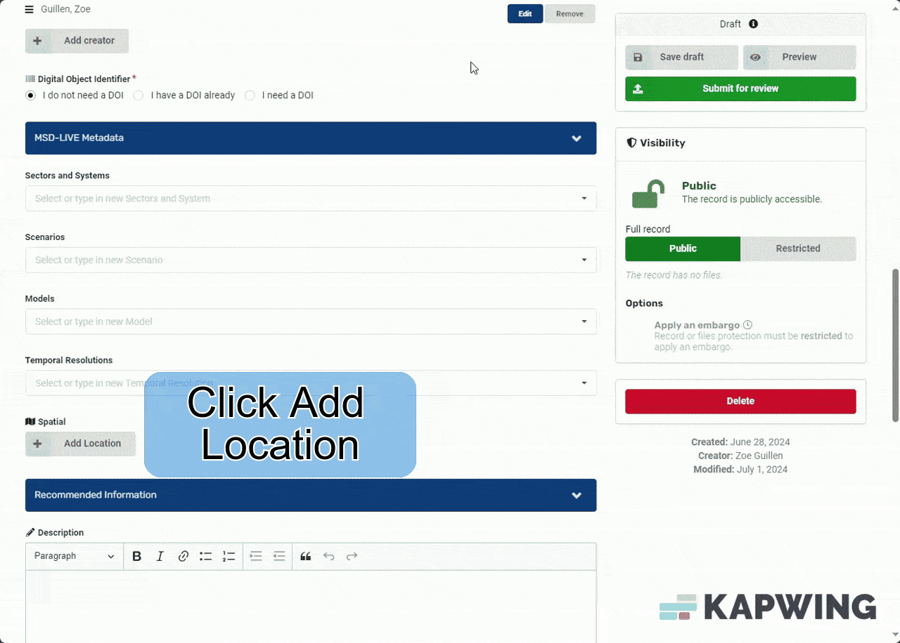

# Spatial Metadata

Adding spatial metadata helps downstream users understand where your data was collected or applied.

## Selecting Common Locations

You can add commonly used locations (for example, the Contiguous United States or "CONUS") to your draft dataset:

## Searching the Catalog for Locations

You can also search the MSD-LIVE data repository catalog for a specific location to use:

## Entering Custom Locations

If you need to define the spatial coverage yourself, you can enter a custom location:

## Adding Spatial Metadata to a Published Record

Spatial metadata can also be added to an already published dataset:

