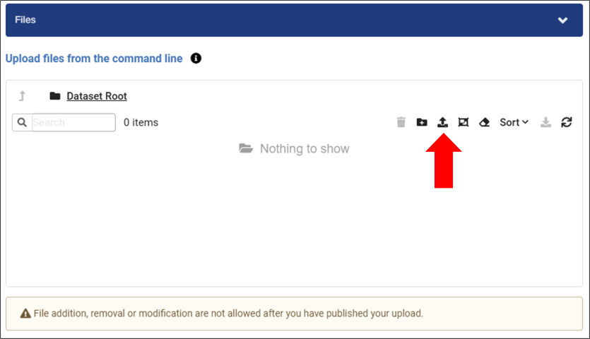

# Upload Your Data

You can upload files to your dataset using the MSD-LIVE Data Repository web interface or the command-line interface (CLI).

## Upload via Web Interface

To upload a dataset using the web interface, click the **Upload** button shown below. 

## Upload via CLI

You can use the MSD-LIVE command-line interface to upload files. **Use the CLI for large files or batches of files, because it offers better performance for large uploads.** The CLI also works on machines without a web browser.

See the [Uploading Files](../tools_services/cli/usage.md#uploading-files) section of the CLI documentation for complete instructions on using the `msdlive upload` command.

