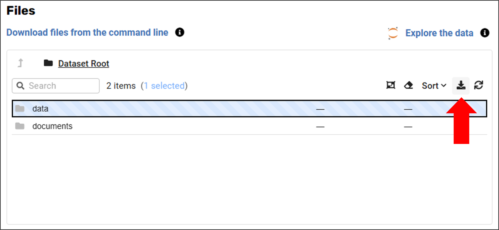

# Download Published Datasets

You can download files from published datasets using the MSD-LIVE Data Repository web interface or the command-line interface (CLI).

## Download via Web Interface

1. Navigate to the dataset you want to download from in the [Data Repository](https://data.msdlive.org/search)
2. Select the files you want to download
3. Click the download button or link on the dataset's landing page
4. Complete the download

## Download via CLI

You can use the MSD-LIVE command-line interface to download datasets. The CLI offers better performance for large files and works on machines without a web browser.

See the [Downloading Files](../tools_services/cli/usage.md#download) section of the CLI documentation for complete instructions on using the `msdlive download` command.
