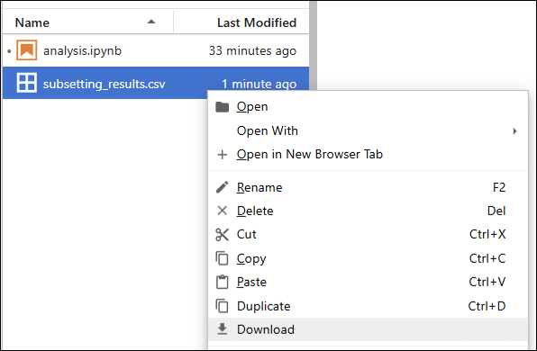
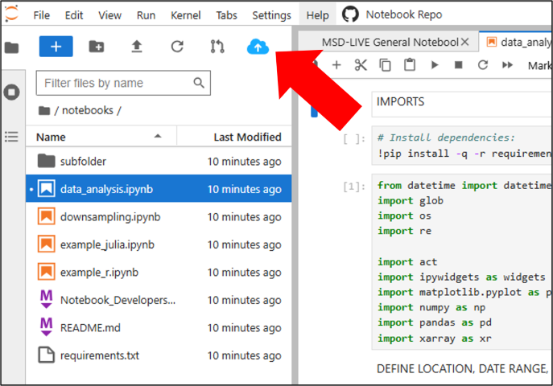

# Download Notebook Results

Once you've processed or subsetted large data in a dataset notebook, you can download your results to your local machine or a remote computer.

## Download via Jupyter Web Interface

For smaller files, you can right-click in the Jupyter file browser and select **Download**.

## Download via Scratch Directory and CLI

For larger files or when working on a machine without a browser, copy your results to your scratch directory and download them using the [MSD-LIVE CLI](../tools_services/cli/usage.md).

### Step 1: Copy to Scratch Directory

1. Open the File Browser (left sidebar in Jupyter)
2. Select the files and/or folders you want to copy
3. Click the blue cloud button in the toolbar
4. Wait for the copy job to complete

### Step 2: Download from Scratch Directory

Use the MSD-LIVE CLI to download files from your scratch directory to your local machine or a remote computer.

See the [Downloading Files](../tools_services/cli/usage.md#downloading-files) section of the CLI documentation for complete instructions on using the `msdlive download --scratch` command.

!!! warning "Scratch Directory Cleanup"

    Files in your scratch directory will be automatically deleted after 24 hours. Be sure to download anything you need before then.
