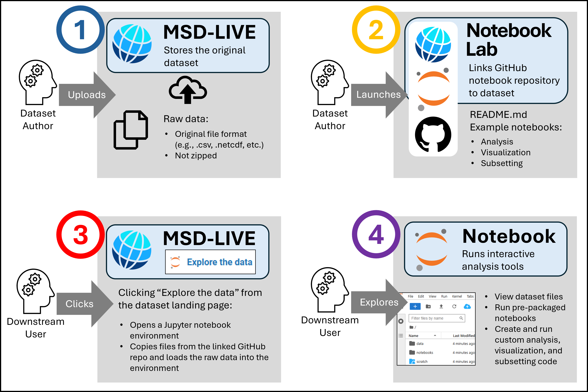

# Explore Data - About

This page provides an overview of how the dataset notebook feature works from the perspective of a data user.
For step-by-step instructions, see the [Explore Data Quick Start](explore_data_quick_start.md).

Watch this video for an overview of the workflow for using MSD-LIVE's dataset notebooks feature:

  <iframe width="560" height="315"
      src="https://www.youtube.com/embed/7DOLFdx5eNA"
      frameborder="0" allowfullscreen>
  </iframe>

---

## Exploring the Data

Data users can explore data in MSD-LIVE by browsing the data repository. If a dataset in the repository supports interactive dataset notebooks, you'll see an "Explore the Data" button on the dataset's landing page. What happens when you click the link?

- A Jupyter Notebook environment spins up in the AWS cloud.
- The dataset's files are accessible in a mounted `data/` folder.
- If provided by the dataset author, the GitHub repo containing the pre-packaged code is cloned into the environment.

## Using the Jupyter Notebook Environment

Once in your Jupyter Notebook environment there are multiple ways to explore the data and interact with it via code:

- Open example notebooks and follow the provided instructions.
- Write your own notebooks using Python, R, or Julia.
- Visualize, analyze, or subset the data.
- Copy files to your scratch directory and download them via the MSD-LIVE command-line interface.
