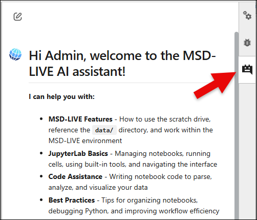

# Writing Notebooks

Notebooks are the primary way to explore, analyze, and work with your data in MSD-LIVE. They combine code, visualizations, and narrative text in a single, interactive environment.

This guide walks you through the basics of writing notebooks, including how to import packages and access your dataset.

Once you've imported the libraries you need and loaded your data, you're ready to:

- Visualize and explore your data  
- Create workflows for subsetting data in space and time  
- Develop analysis pipelines specific to your research questions  
- **Use the AI Assistant to help you write your code**

As you work, remember that notebooks are meant to be iterative—start simple, explore your data, and build up more complex analyses step by step.


!!! warning "Before you start:" 
    You should have basic familiarity with [Jupyter notebooks](https://docs.jupyter.org/en/latest/) 


## Importing Packages

Your notebook environment comes with many common data science libraries pre-installed. Start by importing the packages you need:

### Python

```python
import pandas as pd
import seaborn as sns
import matplotlib.pyplot as plt
```

### Julia

For Julia users, use the `using` statement:

```julia
using DataFrames
using Plots
using StatsPlots
```

### R

For R users, use the `library()` function:

```r
library(tidyverse)
library(ggplot2)
```

Refer to the language-specific documentation for detailed examples and additional libraries available in your environment.

## Accessing Your Data

Dataset files are automatically available in your notebook environment via the `DATA_DIR` environment variable.

- `DATA_DIR` is the **preferred way** to access dataset files
- It points to the mounted dataset location in your environment
- Avoid hardcoding paths like `/data`, as they may change

### Python

```python
import os
from pathlib import Path

data_dir = Path(os.environ["DATA_DIR"])
print("DATA_DIR:", data_dir)

# List files
for p in data_dir.iterdir():
    print("-", p.name)

# Load a CSV file (if present)
csvs = sorted(data_dir.glob("*.csv"))
if csvs:
    df = pd.read_csv(csvs[0])
    df.head()
```

### Julia

```julia
data_dir = ENV["DATA_DIR"]
println("DATA_DIR = ", data_dir)

# Load data files
df = CSV.read(joinpath(data_dir, "your_data.csv"), DataFrame)
```

### R

```r
data_dir <- Sys.getenv("DATA_DIR")
print(paste("DATA_DIR =", data_dir))

# Load data files
df <- read.csv(file.path(data_dir, "your_data.csv"))
```

## Accessing Multiple Datasets

You can access multiple datasets from within your notebook environment. The `OTHER_DATASETS_DIR` environment variable points to all public datasets with file exploration enabled. You can access another dataset by its Record ID:

```python
import os
from pathlib import Path

# OTHER_DATASETS_DIR points to all public datasets with file exploration enabled
public_dir = Path(os.environ['OTHER_DATASETS_DIR'])
print("OTHER_DATASETS_DIR =", public_dir)

# Access another dataset by its Record ID
other_dataset_id = "6yawb-zyx60"
other_data_path = public_dir / other_dataset_id

print(f"Files available in dataset {other_dataset_id}:")
for f in other_data_path.iterdir():
    print(" -", f.name)
```

This allows you to combine data from multiple datasets in your analysis.


## Using the MSD-LIVE AI Assistant

You can open the **MSD-LIVE AI Assistant** from the right sidebar while working in your notebook environment.

This built-in chatbot is designed to help you create high-quality dataset notebooks. It can assist with:

- **MSD-LIVE features:** Using the scratch directory, referencing `DATA_DIR` and `OTHER_DATASETS_DIR`, and working in the environment.
- **JupyterLab help:** Running cells, managing notebooks, and navigating the interface.
- **Code assistance:** Writing Python, R, or Julia code to load, inspect, analyze, and visualize your data.
- **Notebook best practices:** Organizing workflow, debugging, and improving notebook quality.



Use the AI Assistant whenever you need quick guidance or examples while developing your notebooks.

> ### Best Practices
> 
> - **Keep notebooks focused** — Create one notebook per analysis or workflow
> - **Write clear explanations** — Use markdown cells and comments to explain each section
> - **Include practical examples** — Show users how to subset, filter, and transform data
> - **Test thoroughly** — Run notebooks against real data before publishing
> - **Document dependencies** — List required packages and any external data
> - **Use descriptive filenames** — Make notebook purpose clear at a glance
> - **Update your README** — Briefly describe each example notebook in the repository
> - **Save frequently** — If using Notebook Lab, save often (3-hour session limit)
