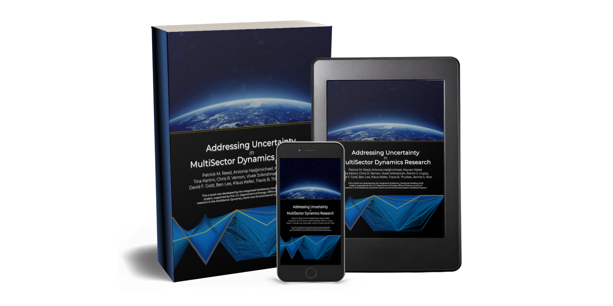
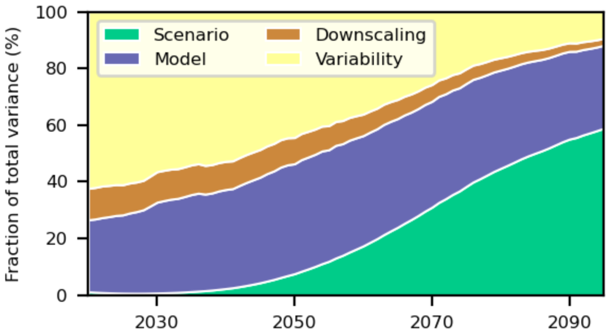
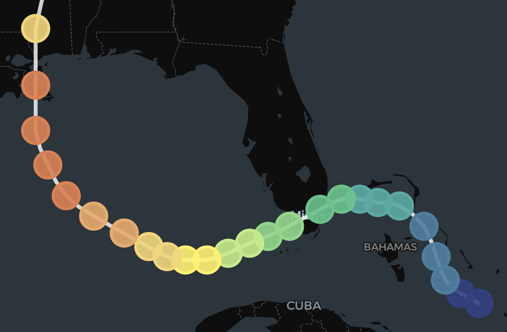

# Computational Resources

MSD-LIVE harnesses the power of Amazon Web Services cloud infrastructure to provide secure, scalable, on-demand computing solutions for MSD projects.

## In Situ Dataset Exploration

Our newest computational offering is the ability to explore datasets directly in MSD-LIVE via Jupyter notebooks.

[Explore In Situ Dataset Exploration](../for_data_users/explore_data_about.md)

## Uncertainty Characterization eBook

Created by the IM3 project, the UC eBook is a living guide to sensitivity analysis and diagnostic model evaluation techniques for confronting the computational and conceptual challenges of multi-model, transdisciplinary workflows.

[Open the UC eBook](https://uc-ebook.org/)

## Model Training Notebooks

MSD projects use cloud-computing capabilities in MSD-LIVE to create interactive Jupyter notebooks that train users to configure, run, and analyze MSD models.

[Go to Model Training Notebooks Overview](model_training_notebooks.md)

??? info "Model Training Notebook Resources"

	#### demeter

	

	demeter is an open-source land use and land cover change disaggregation model.

	[Open demeter](http://demeter.msdlive.org/)

	#### gcam

	

	A demonstration on how to conduct scenario adjustments and user modifications in GCAM, including scenario design and methods for creating and editing scenarios.

	[Open gcam](https://gcam.msdlive.org)

	#### gcamwrapper

	

	gcamwrapper contains C++, R, and Python source code that wraps GCAM so simulations can be run interactively.

	[Open gcamwrapper](https://gcamwrapper.msdlive.org)

	#### hector

	

	hector is a simple climate model that can be embedded with GCAM.

	[Open hector](http://hector.msdlive.org/)

	#### matilda

	

	matilda is a probabilistic framework for the hector simple climate model.

	[Open matilda](http://matilda.msdlive.org/)

	#### rgcam

	

	rgcam is an open-source package used to interact with GCAM outputs (rgram, rchart, and rmap).

	[Open rgcam](http://rgcam.msdlive.org/)

	#### statemodify

	

	statemodify is an open-source Python package for modifying StateMod input and output files to enable exploratory modeling.

	[Open statemodify](https://statemodify.msdlive.org)

	#### stitches

	

	stitches is a computationally efficient emulator that preserves temporal and spatial resolution and joint coherence of multiple climate model output variables.

	[Open stitches](https://stitches.msdlive.org)

	#### tethys

	

	tethys facilitates coupling between large-scale and fine-resolution models by downscaling region-scale water demand onto a grid.

	[Open tethys](https://tethys.msdlive.org)

	#### xanthos

	

	xanthos is an open-source hydrologic model written in Python that simulates historical and future global water availability on a monthly time step.

	[Open xanthos](https://xanthos.msdlive.org)

## Interactive Data Dashboards

MSD-LIVE users can create interactive data dashboards that allow downstream users to explore and visualize datasets without downloading the underlying data.

[Go to Interactive Dashboards Overview](interactive_dashboards.md)

??? info "Interactive Dashboard Resources"

	#### lafferty-sriver-2023-downscaling-uncertainty

	

	This interactive dashboard allows users to create visualizations of the dataset underpinning the Lafferty and Sriver 2023 paper published in NPJ Climate and Atmospheric Science.

	[Open dashboard](https://lafferty-sriver-2023-downscaling-uncertainty.msdlive.org)

	#### ICoM RAFT Hurricane Projections Dataset

	

	This dashboard visualizes 620 historic tropical cyclones from 1979 to 2018 replayed under eight future climate scenarios.

	[Open dashboard](https://raft-hurricane-projections.msdlive.org/)
