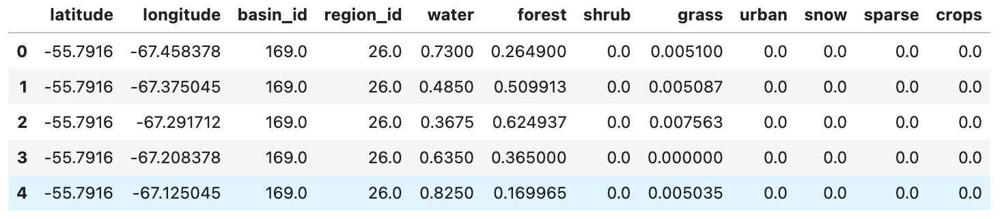
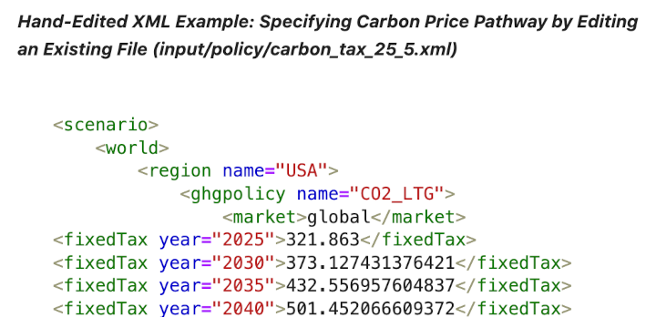
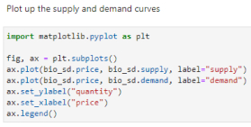
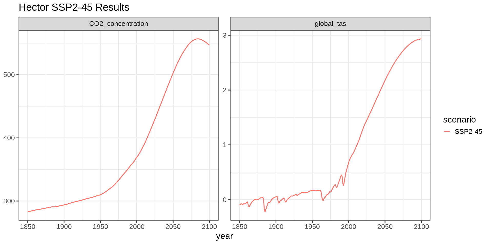
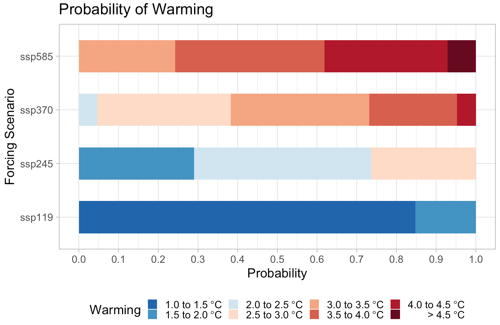
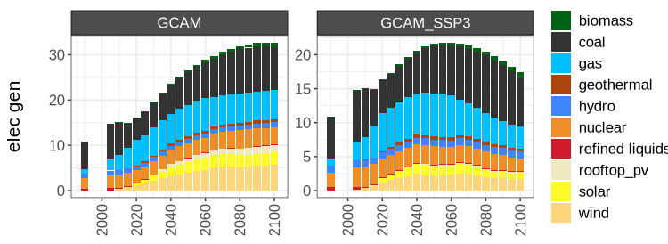
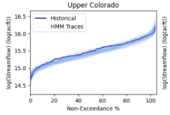
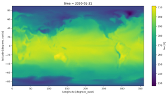
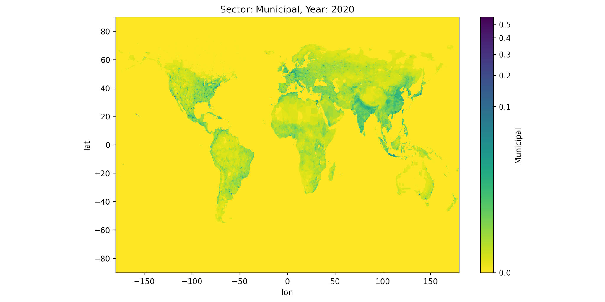
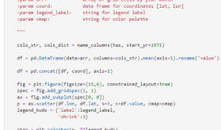

# Model Training Notebooks

MSD projects use cloud-computing capabilities in MSD-LIVE to create interactive Jupyter notebooks that train users to configure, run, and analyze MSD models.

These interactive model training notebooks provide hands-on learning experiences, allowing users to explore model configurations, run simulations, and analyze results in a cloud-based environment.

---

## Available Model Training Resources

### demeter

demeter is an open-source land use and land cover change disaggregation model.

[Open demeter](http://demeter.msdlive.org/)

---

### gcam

A demonstration on how to conduct scenario adjustments and user modifications in GCAM, including scenario design and methods for creating and editing scenarios.

[Open gcam](https://gcam.msdlive.org)

---

### gcamwrapper

gcamwrapper contains C++, R, and Python source code that wraps GCAM so simulations can be run interactively.

[Open gcamwrapper](https://gcamwrapper.msdlive.org)

---

### hector

hector is a simple climate model that can be embedded with GCAM.

[Open hector](http://hector.msdlive.org/)

---

### matilda

matilda is a probabilistic framework for the hector simple climate model.

[Open matilda](http://matilda.msdlive.org/)

---

### rgcam

rgcam is an open-source package used to interact with GCAM outputs (rgram, rchart, and rmap).

[Open rgcam](http://rgcam.msdlive.org/)

---

### statemodify

statemodify is an open-source Python package for modifying StateMod input and output files to enable exploratory modeling.

[Open statemodify](https://statemodify.msdlive.org)

---

### stitches

stitches is a computationally efficient emulator that preserves temporal and spatial resolution and joint coherence of multiple climate model output variables.

[Open stitches](https://stitches.msdlive.org)

---

### tethys

tethys facilitates coupling between large-scale and fine-resolution models by downscaling region-scale water demand onto a grid.

[Open tethys](https://tethys.msdlive.org)

---

### xanthos

xanthos is an open-source hydrologic model written in Python that simulates historical and future global water availability on a monthly time step.

[Open xanthos](https://xanthos.msdlive.org)
